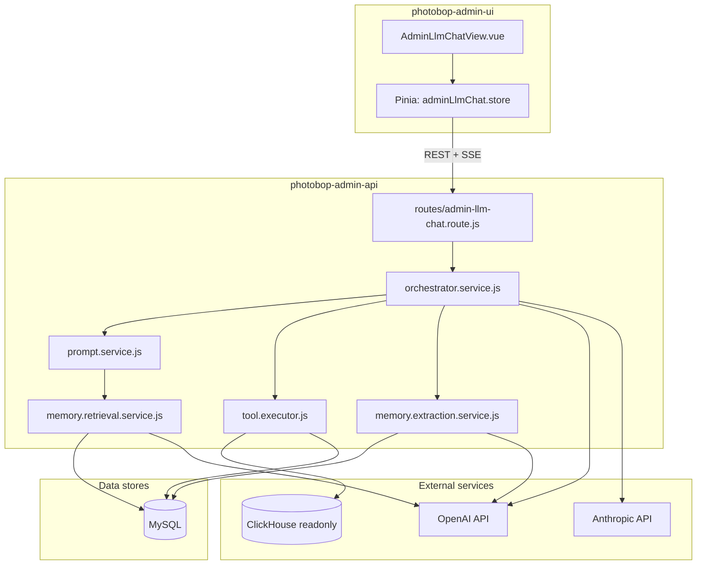
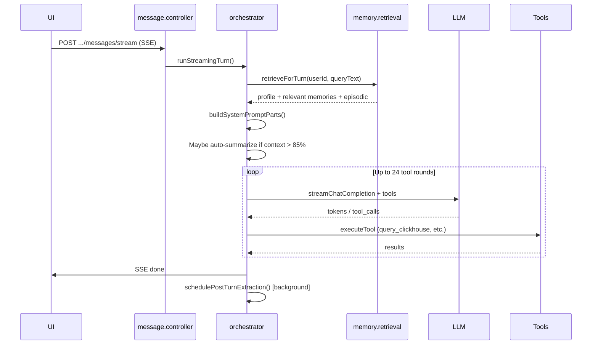
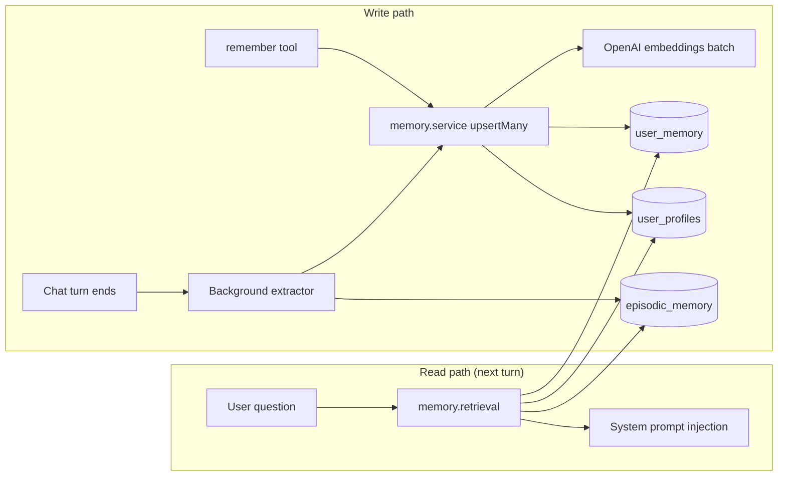

# Admin LLM Chat — Module Guide

**Last updated:** June 2026  
**Audience:** New team members assigned to maintain or extend this feature  
**Repos:** `photobop-admin-api`, `photobop-admin-ui`, `photobop-db-migrations`

---

## Table of contents

1. [What is this module?](#1-what-is-this-module)
2. [High-level architecture](#2-high-level-architecture)
3. [Repository layout](#3-repository-layout)
4. [How a chat turn works](#4-how-a-chat-turn-works)
5. [Memory system (long-term)](#5-memory-system-long-term)
6. [Within-conversation memory (short-term)](#6-within-conversation-memory-short-term)
7. [Configuration](#7-configuration)
8. [Database tables](#8-database-tables)
9. [API reference](#9-api-reference)
10. [Admin UI (frontend)](#10-admin-ui-frontend)
11. [LLM providers and models](#11-llm-providers-and-models)
12. [Database query conventions](#12-database-query-conventions)
13. [Testing](#13-testing)
14. [Deployment checklist](#14-deployment-checklist)
15. [Troubleshooting](#15-troubleshooting)
16. [Common tasks for new developers](#16-common-tasks-for-new-developers)

---

## 1. What is this module?

**Admin LLM Chat** is an internal analytics assistant for the admin panel. Admins ask business questions (ad spend, revenue, funnels, product metrics) and the AI answers by querying **read-only** databases — not by guessing.

| Property | Detail |
|----------|--------|
| **Users** | Internal admins with permission `admin_llm_chat` |
| **Not** | A general-purpose chatbot (jokes, homework, etc. are refused) |
| **Data sources** | ClickHouse (analytics time-series) + MySQL (transactional app data) |
| **UI route** | `/admin-llm-chat` in `photobop-admin-ui` |
| **API base** | `/v1/admin/llm-chat` in `photobop-admin-api` |

The assistant can also render charts/widgets inline and remembers user preferences across conversations.

---

## 2. High-level architecture



**Key idea:** The UI streams responses over SSE. The API runs an **orchestrator loop** that calls the LLM, executes tools (SQL queries), and streams tokens/events back. Memory is loaded before each turn and optionally updated after.

---

## 3. Repository layout

### photobop-admin-api — `modules/admin-llm-chat/`

| Folder / file | Purpose |
|---------------|---------|
| `routes/` | HTTP route definitions |
| `controllers/` | Thin handlers (validate auth, call services, return JSON/SSE) |
| `services/admin-llm-chat.orchestrator.service.js` | **Core engine** — tool loop, streaming, turn completion |
| `services/prompt.service.js` | Builds system prompt + message history for the LLM |
| `services/memory.*.js` | Long-term memory (retrieve, store, extract, embed, profile) |
| `services/context.summary.service.js` | Compresses long conversations (within-chat memory) |
| `services/llm-auxiliary.client.js` | Small non-streaming LLM calls (title, summary, extraction) |
| `tools/` | ClickHouse, MySQL, `remember`, `render_widget`, `run_analysis_code` |
| `models/` | MySQL data access (no ORM) |
| `constants/` | Prompts, tool registry, ClickHouse whitelist, config constants |
| `middlewares/` | Feature flag, digest HMAC |
| `validators/` | Joi request schemas |

### photobop-admin-ui — `src/components/admin-llm-chat/`

| Folder / file | Purpose |
|---------------|---------|
| `views/AdminLlmChatView.vue` | Main chat page |
| `store/adminLlmChat.store.js` | Pinia state + SSE handling |
| `services/adminLlmChat.service.js` | REST API client |
| `services/adminLlmChat.stream.service.js` | SSE stream client |
| `components/UserMemoryPanel.vue` | Settings → Memory tab |
| `components/AiChatSettingsSlideout.vue` | Settings drawer (Business + Memory tabs) |

### photobop-db-migrations

| Migration | Purpose |
|-----------|---------|
| `20260520121000-create-admin-llm-chat-tables` | Core tables (conversations, messages, user_memory, etc.) |
| `20260520122000-admin-llm-chat-context-summaries` | Conversation compression summaries |
| `20260605120000-admin-llm-chat-memory-v2` | Memory v2: embeddings, profiles, episodic memory |

---

## 4. How a chat turn works

When an admin sends a message:



### SSE events the UI listens for

| Event | Meaning |
|-------|---------|
| `meta` | Message ID, model info |
| `thinking` | Agent is planning / running tools |
| `token` | Streaming text chunk |
| `tool_start` / `tool_end` | Tool execution progress |
| `widget` | Chart/KPI spec to render |
| `context_usage` | How full the context window is |
| `context_summarizing` | Compressing old messages |
| `done` | Turn finished |
| `error` | Something failed |

### Tools available to the LLM

| Tool | What it does |
|------|----------------|
| `list_clickhouse_tables` | Discover analytics tables |
| `get_table_schema` | Column names (required before querying CH) |
| `query_clickhouse` | Run SELECT on one whitelisted CH table |
| `list_mysql_tables` / `query_mysql` | Transactional app data |
| `run_analysis_code` | Merge multi-query results in a sandbox |
| `remember` | Save a fact for this admin across future chats |
| `render_widget` | Emit a chart/KPI/table to the UI |

---

## 5. Memory system (long-term)

Memory lets the assistant **remember things across different chat conversations** for the same admin user.

### Three layers of long-term memory

| Layer | Storage | Scope | Example |
|-------|---------|-------|---------|
| **Semantic memories** | `admin_llm_chat_user_memory` | Per admin user | `preferred_currency: INR` |
| **User profile** | `admin_llm_chat_user_profiles` | Per admin user | `{ currency: "INR", focus_channels: ["meta"] }` |
| **Episodic memories** | `admin_llm_chat_episodic_memory` | Per user, from past chats | "Analyzed Meta spend for last 28 days, ROAS 2.1x" |

### How memories get written

| Method | When | Code |
|--------|------|------|
| **`remember` tool** | LLM explicitly saves during a turn | `tools/tool.executor.js` → `memory.service.js` |
| **Background extraction** | After each substantive turn (async) | `memory.extraction.service.js` |
| **Admin UI / API** | Manual edit in Settings → Memory | `memory.controller.js` |

Background extraction uses a small LLM (`gpt-4o-mini`) to pull durable facts from the conversation. It does **not** block the user's response.

### How memories get read (each turn)

`memory.retrieval.service.js` runs **before** the LLM is called:

1. **Parallel reads** (3 simple queries, no JOINs):
   - User profile
   - All active semantic memories for user
   - Recent episodic summaries (up to `episodicCandidateLimit`)
2. **Embed the user's question** via OpenAI `text-embedding-3-small`
3. **Score each memory** with hybrid ranking:
   - 70% semantic similarity (cosine on embeddings)
   - 30% keyword overlap
4. **Inject top-K** into the system prompt

Profile is **always** injected. Semantic and episodic memories are **query-conditioned** (only relevant ones).

### Memory flow diagram



### Important: user-scoped vs conversation-scoped

| Data | Scoped to |
|------|-----------|
| Semantic memories, profile, episodic | **Admin user** (cross-chat) |
| Messages, tool traces, context summaries | **Single conversation** |

---

## 6. Within-conversation memory (short-term)

Separate from long-term memory. Keeps one long chat usable without blowing the context window.

| Mechanism | Trigger | Storage |
|-----------|---------|---------|
| **Verbatim tail** | Always | Last 6 messages kept in full |
| **Context summary** | Context usage ≥ 85% | `admin_llm_chat_context_summaries` |

Code: `context.summary.service.js`, `prompt.service.js` (`VERBATIM_TAIL = 6`).

This is **not** the same as episodic memory. Context summaries only help the **current** conversation continue. Episodic summaries help **future** conversations recall past analyses.

---

## 7. Configuration

Configuration follows the same pattern as other admin-llm-chat settings (`maxToolCallsPerTurn`, `widgets`, etc.).

### Priority order (highest wins)

1. Environment variable — e.g. `ADMIN_LLM_CHAT_MEMORY_TOP_K=5`
2. `config/env/local.js` → `adminLlmChat.memory.*` (local dev overrides)
3. `config/env/env.js` → `adminLlmChat.memory.*` (defaults for all envs)
4. Hardcoded fallback in `constants/admin-llm-chat.constants.js`

### Where to configure

**You usually do NOT need a `memory` block in `local.js`.** Defaults in `env.js` are enough.

Only add overrides when you want to change behavior:

```javascript
// config/env/local.js — inside adminLlmChat
memory: {
  extractionEnabled: false,  // disable auto-learning; keep remember tool only
  embeddingEnabled: true,    // requires OpenAI API key
},
```

### Memory config keys explained

#### On/off switches (leave `true` unless you have a reason)

| Key | Default | What it does |
|-----|---------|--------------|
| `retrievalEnabled` | `true` | Query-conditioned memory retrieval each turn |
| `embeddingEnabled` | `true` | Use OpenAI embeddings for semantic search |
| `backgroundEnabled` | `true` | Run post-turn memory pipeline |
| `extractionEnabled` | `true` | Auto-extract facts after turns |
| `episodicEnabled` | `true` | Save session summaries after tool-using turns |
| `profileAutoUpdate` | `true` | Merge extracted facts into user profile JSON |
| `extractWhenRememberUsed` | `false` | Skip background extract if agent already called `remember` |

#### Embedding

| Key | Default | What it does |
|-----|---------|--------------|
| `embeddingModel` | `text-embedding-3-small` | OpenAI embedding model for memory search |

**This is NOT your chat model.** Embeddings convert text to vectors for similarity search. Chat models (GPT, Claude) are used separately for reasoning and extraction.

Provider: **OpenAI only** (uses `llmProviders.openai.apiKey`). If the key is missing, embeddings fail silently and retrieval falls back to keyword matching only.

#### Retrieval tuning (rarely change)

| Key | Default | What it does |
|-----|---------|--------------|
| `retrievalTopK` | `8` | Max semantic memories injected per turn |
| `episodicTopK` | `3` | Max past-analysis summaries per turn |
| `episodicCandidateLimit` | `30` | How many episodic rows to score |
| `retrievalMinScore` | `0.12` | Minimum hybrid score to include a memory |
| `retrievalSemanticWeight` | `0.7` | Weight for embedding similarity |
| `retrievalKeywordWeight` | `0.3` | Weight for keyword overlap |
| `fullDumpMax` | `20` | Max memories when no query text (edge case) |

#### Rate limits (rarely change)

| Key | Default | What it does |
|-----|---------|--------------|
| `extractionPerUserPerMin` | `8` | Background extraction RPM per admin |
| `episodicPerUserPerMin` | `4` | Episodic extraction RPM per admin |
| `extractionMaxPerTurn` | `5` | Max facts extracted per turn |

#### Unused keys (defined but not wired yet)

| Key | Note |
|-----|------|
| `fullDumpThreshold` | Not used in current retrieval code |
| `defaultTtlDays` | Not used yet (memories don't auto-expire) |

### Other admin-llm-chat config (non-memory)

In `adminLlmChat` at the same level as `memory`:

| Key | Purpose |
|-----|---------|
| `enabled` | Master feature flag |
| `maxToolCallsPerTurn` | Tool budget per message (default 24) |
| `maxConcurrentStreamsPerUser` | Parallel chats per admin |
| `companyName` | Brand name in prompts |
| `widgets` | Per-widget rollout flags |

Env: `ADMIN_LLM_CHAT_ENABLED=true` for non-local environments.

---

## 8. Database tables

### Core tables (original migration)

| Table | Purpose |
|-------|---------|
| `admin_llm_chat_conversations` | Chat metadata, model, token totals |
| `admin_llm_chat_messages` | Messages with `content_parts` JSON trace |
| `admin_llm_chat_tool_calls` | Tool invocations per assistant message |
| `admin_llm_chat_attachments` | File uploads (R2) |
| `admin_llm_chat_user_memory` | Key-value facts per admin user |
| `admin_llm_chat_context_summaries` | Within-conversation compression |
| `admin_llm_chat_usage_daily` | Per-user daily token/cost aggregates |

### Memory v2 tables (migration `20260605120000`)

**Extended `admin_llm_chat_user_memory` columns:**

| Column | Purpose |
|--------|---------|
| `memory_type` | `semantic` (default) |
| `embedding_json` | Vector for similarity search |
| `embedding_model` | Which model created the embedding |
| `source_conversation_id` | Where the memory came from |
| `metadata_json` | `{ source, category }` etc. |
| `deleted_at` | Soft delete |
| `expires_at` | Optional TTL (not enforced yet) |

**New tables:**

| Table | Purpose |
|-------|---------|
| `admin_llm_chat_user_profiles` | Structured profile JSON per user |
| `admin_llm_chat_episodic_memory` | Past session summaries per user |

### Run migrations

```bash
cd photobop-db-migrations
db-migrate up
```

Verify: `20260605120000-admin-llm-chat-memory-v2` applied.

---

## 9. API reference

Base path: `/v1/admin/llm-chat`  
Auth: Admin session + permission `admin_llm_chat`

### Chat

| Method | Path | Purpose |
|--------|------|---------|
| GET | `/models` | List available LLM models |
| GET/POST | `/conversations` | List / create |
| GET | `/conversations/:id` | Load conversation + messages |
| POST | `/conversations/:id/messages/stream` | **Send message (SSE)** |
| DELETE | `/conversations/:id/stream` | Abort in-flight turn |

### Memory (new)

| Method | Path | Purpose |
|--------|------|---------|
| GET | `/memories` | List current user's semantic memories |
| GET | `/memories/:memoryKey` | Get one memory |
| PUT | `/memories/:memoryKey` | Create/update memory |
| DELETE | `/memories/:memoryKey` | Soft-delete memory |
| GET | `/memories/episodic/list` | List past analysis summaries |
| DELETE | `/memories/episodic/:episodicId` | Delete episodic entry |
| GET | `/memories/profile` | Get structured profile |
| PATCH | `/memories/profile` | Update profile |

**Note:** Static routes (`/memories/episodic/list`, `/memories/profile`) are registered **before** `/memories/:memoryKey` to avoid route conflicts.

### Other

| Method | Path | Purpose |
|--------|------|---------|
| GET/PATCH | `/business-context` | Shared KPI config (all admins) |
| GET | `/healthz` | Health check (no auth) |

---

## 10. Admin UI (frontend)

**Route:** `/admin-llm-chat/:conversationId` (`new` or UUID)

### Key files

| File | Role |
|------|------|
| `AdminLlmChatView.vue` | Page shell, send flow, scroll |
| `adminLlmChat.store.js` | State, SSE event handling, stream recovery |
| `adminLlmChat.service.js` | REST calls including memory APIs |
| `UserMemoryPanel.vue` | View/delete memories, edit profile |
| `AiChatSettingsSlideout.vue` | Settings → **Business** and **Memory** tabs |

### Settings → Memory tab

Admins can:
- View and delete saved semantic memories
- View and delete episodic (past analysis) summaries
- Edit the structured user profile JSON

### Streaming

The UI uses `fetch` + custom SSE parser (not axios) for `POST .../messages/stream`. REST uses axios with cookies.

---

## 11. LLM providers and models

Three different AI calls happen in this module. **Do not confuse them.**

| Task | Model | Provider | Config |
|------|-------|----------|--------|
| **Main chat** | e.g. `gpt-5.5`, Claude | OpenAI or Anthropic | `constants/models.json`, user picks in UI |
| **Title, summary, memory extraction** | `gpt-4o-mini` | OpenAI (fallback) | `models.json` summarizer entry |
| **Memory embeddings** | `text-embedding-3-small` | **OpenAI only** | `adminLlmChat.memory.embeddingModel` |

### Why embeddings are not GPT/Claude

- Chat models generate text. **Embedding models** convert text to numbers for similarity search.
- Embeddings are ~100× cheaper and faster for retrieval.
- Industry standard (Mem0, LangChain, etc.): embedding model for search, chat model for reasoning.

### If you want better memory recall

1. First try: lower `retrievalMinScore` or increase `retrievalTopK`
2. Upgrade: `embeddingModel: 'text-embedding-3-large'` (better, more expensive)
3. Last resort: `embeddingEnabled: false` (keyword-only, no OpenAI embed cost)

---

## 12. Database query conventions

This codebase follows strict DB rules (see `.cursor/rules/api-database-pagination.mdc`):

| Rule | Memory module compliance |
|------|--------------------------|
| **No SQL JOINs** | ✅ All memory queries are single-table |
| **No subqueries** | ✅ None used |
| **No queries inside loops** | ✅ Batch `upsertMany`, `Promise.all` for reads |
| **Stitch in application code** | ✅ Scoring/ranking done in Node, not SQL |

### Memory read path (per turn)

```
3 parallel queries → score in memory → inject top-K into prompt
```

### Memory write path (background)

```
1 batch embed API call → 1 batch INSERT upsert → 1 profile merge
```

---

## 13. Testing

```bash
cd photobop-admin-api
npm run test:admin-llm-chat
```

### Memory-specific test files

| File | Tests |
|------|-------|
| `memory.embedding.service.test.js` | Cosine similarity, keyword scoring |
| `memory.retrieval.service.test.js` | Hybrid retrieval, profile injection |
| `memory.extraction.service.test.js` | Background scheduler exports |
| `memory.service.test.js` | Batch upsert (one embed + one DB call) |

### Running a subset

```bash
NODE_ENV=local ./node_modules/.bin/mocha tests/unit/admin-llm-chat/memory*.test.js --timeout 10000
```

---

## 14. Deployment checklist

### Required

- [ ] Run DB migration `20260605120000-admin-llm-chat-memory-v2`
- [ ] OpenAI API key in `llmProviders.openai.apiKey` (embeddings + extraction)
- [ ] `ADMIN_LLM_CHAT_ENABLED=true` (or `adminLlmChat.enabled: true`)
- [ ] Admin role has permission `admin_llm_chat`
- [ ] ClickHouse readonly user configured (`clickhouse.adminLlmChatReadonly`)
- [ ] MySQL readonly user configured (`mysql.adminLlmChatReadonly`)

### Not required

- [ ] Copying `local.js` memory block to production — `env.js` defaults apply
- [ ] Anthropic key — only needed if you use Anthropic chat models

### Do NOT

- Copy entire `local.js` to production (contains local secrets/URLs)
- Commit API keys to git

---

## 15. Troubleshooting

### Memory not persisting across chats

1. Check migration applied: `memory_type` column exists on `admin_llm_chat_user_memory`
2. Check `backgroundEnabled` and `extractionEnabled` are `true`
3. Check OpenAI key works (embeddings + extraction use it)
4. Ask explicitly: "Remember that I prefer INR" — triggers `remember` tool
5. Check Settings → Memory tab in admin UI

### Embeddings failing silently

Symptom: memories save but retrieval is keyword-only (weak on paraphrases).

- Verify `llmProviders.openai.apiKey` in config
- Check logs for OpenAI errors in background extraction
- Set `embeddingEnabled: false` explicitly if you want to skip embed calls

### "Unknown column" errors

Migration not run. Apply `20260605120000-admin-llm-chat-memory-v2`.

The code has a legacy fallback (works without migration) but embeddings/profiles/episodic won't function fully.

### Context window filling up

- Auto-summarize triggers at 85% (`CONTEXT_USAGE_AUTO_PCT`)
- Last 6 turns always kept verbatim
- Long-term memories are retrieved by relevance, not dumped in full

### Tool budget exhausted

After 24 tool calls per turn, user sees "Continue analysis" CTA. Increase `maxToolCallsPerTurn` in config if needed.

---

## 16. Common tasks for new developers

### Add a new tool for the LLM

1. Implement in `tools/`
2. Register in `constants/tool.registry.js`
3. Add case in `tools/tool.executor.js`
4. Document in `constants/system.prompts/v1.system.txt`
5. Add unit tests

### Change the system prompt

Edit `constants/system.prompts/v1.system.txt`. Conversations store `system_prompt_version` (`v1`).

### Change memory extraction behavior

Edit `constants/system.prompts/v1.memory-extract.txt` or `v1.episodic-extract.txt`.

### Add a new memory API endpoint

1. Add handler in `controllers/memory.controller.js`
2. Register route in `routes/admin-llm-chat.route.js` (static routes before `:param` routes)
3. Add Joi schema in `validators/schema/admin-llm-chat.schema.js`
4. Add client method in `admin-ui` → `adminLlmChat.service.js`

### Disable auto-learning (keep manual `remember` only)

```javascript
// env.js or local.js
memory: {
  extractionEnabled: false,
  episodicEnabled: false,
}
```

### Debug what memories were injected

Add temporary logging in `memory.retrieval.service.js` → `retrieveForTurn()` return value (`selectedCount`, `episodicCount`).

---

## Quick reference — file map for memory

```
modules/admin-llm-chat/
├── controllers/memory.controller.js      # REST API
├── models/
│   ├── memory.model.js                   # user_memory CRUD + upsertMany
│   ├── profile.model.js                  # user_profiles
│   └── episodic.model.js                 # episodic_memory
├── services/
│   ├── memory.retrieval.service.js       # Read path (each turn)
│   ├── memory.extraction.service.js      # Write path (background)
│   ├── memory.service.js                 # Upsert + batch embed
│   ├── memory.embedding.service.js       # OpenAI embeddings + scoring
│   └── memory.profile.service.js         # Profile merge
├── constants/system.prompts/
│   ├── v1.memory-extract.txt             # Background fact extraction prompt
│   └── v1.episodic-extract.txt           # Session summary prompt
└── tools/tool.executor.js                # remember tool
```

---

## Related docs

- Admin UI widget patterns: `photobop-admin-ui/docs/SDUI_WIDGET_DESIGN.md`
- ClickHouse whitelist: `modules/admin-llm-chat/constants/clickhouse.whitelist.js`
- Table relationship hints: `modules/admin-llm-chat/constants/table.relationships.js`
