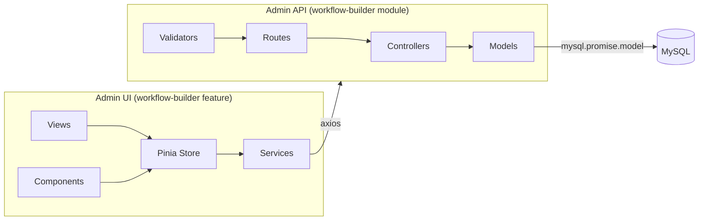
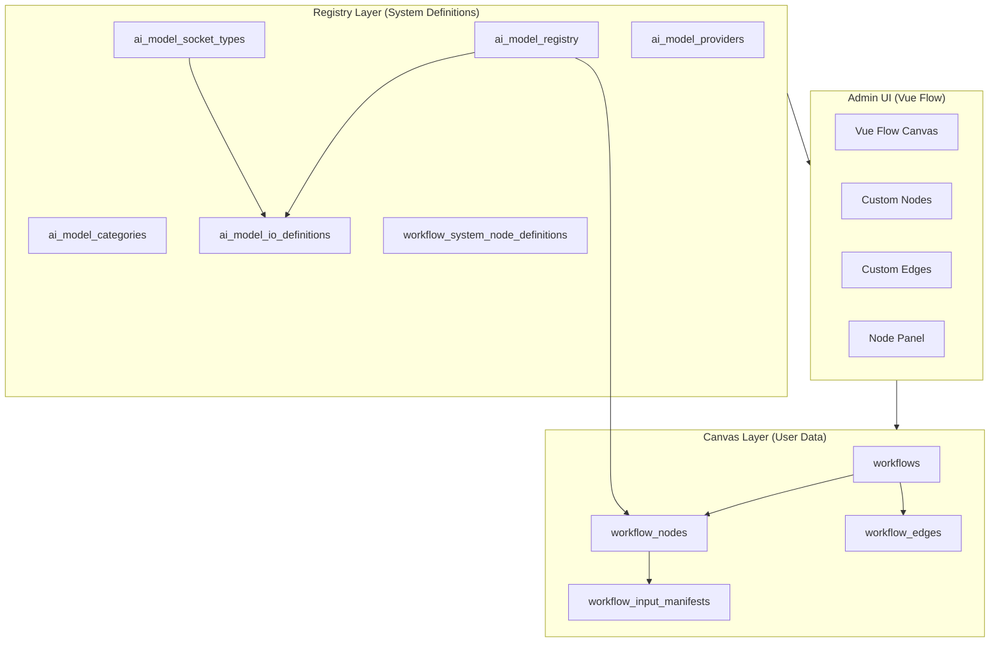
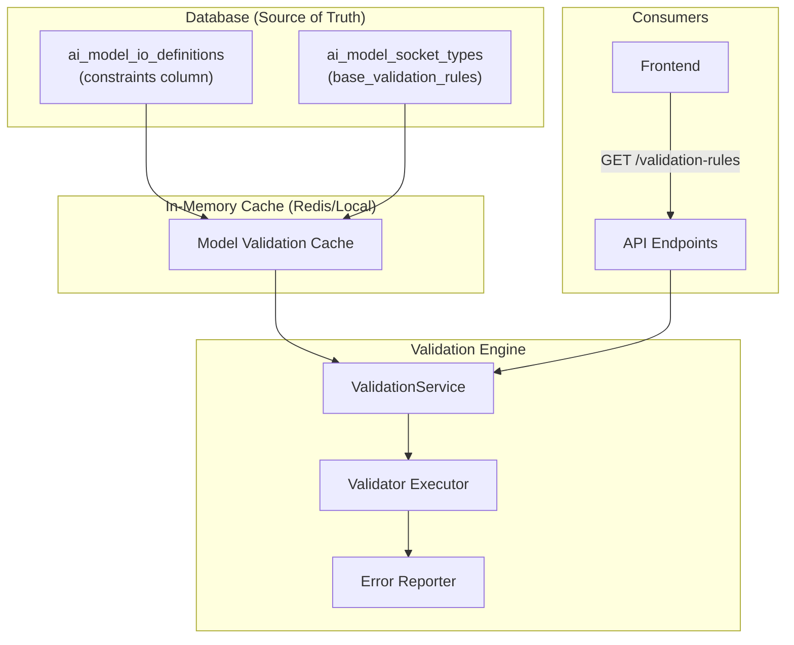

# Tellow AI Workflow Engine - Technical Implementation Plan

## Overview

This document outlines the implementation plan for a node-based visual workflow editor for constructing complex, multi-model generative AI pipelines. The system uses **Vue Flow** (MIT licensed) for the frontend and follows a three-layer architecture: Registry (definitions), Graph (canvas), and Runtime (execution).

**Key Design Principle**: Both API and UI follow **existing project patterns and conventions** to ensure consistency and maintainability.

---

## Architecture Following Existing Patterns

### API Module (Following Existing Module Structure)

Uses the same patterns as `modules/ai-models/`, `modules/templates/`:

- Controllers handle HTTP requests and responses
- Models use `mysql.promise.model` for database queries
- Routes use `versionConfig.routePrefix` and `AuthMiddleware.isAdminUser`
- Validators use Joi schemas
- Error handlers map MySQL errors to user-friendly messages

### UI Feature (Following Existing Feature Structure)

Uses the same patterns as `components/templates/`:

- Views are page-level components
- Components are reusable UI pieces
- Store uses Pinia with `defineStore`, `state()`, `actions`
- Services use the existing axios instance from `@/stores/axios`
- Toast notifications via existing `$toast` system
- Validation via reactive refs with inline error display




---

## Architecture Summary




---

## Part 1: Database Migrations

### Phase 1A: AI Registry Tables (New)

**Migration: `YYYYMMDDHHMMSS-create-ai-model-providers-table.js**`

```sql
CREATE TABLE ai_model_providers (
    amp_id BIGINT UNSIGNED AUTO_INCREMENT PRIMARY KEY,
    name VARCHAR(255) NOT NULL,
    slug VARCHAR(50) NOT NULL UNIQUE,
    api_base_url VARCHAR(255),
    auth_config JSON,
    is_active BOOLEAN DEFAULT TRUE,
    created_at TIMESTAMP DEFAULT CURRENT_TIMESTAMP,
    updated_at TIMESTAMP DEFAULT CURRENT_TIMESTAMP ON UPDATE CURRENT_TIMESTAMP
);
```

**Migration: `YYYYMMDDHHMMSS-create-ai-model-categories-table.js**`

```sql
CREATE TABLE ai_model_categories (
    amc_id INT UNSIGNED AUTO_INCREMENT PRIMARY KEY,
    name VARCHAR(100) NOT NULL,
    slug VARCHAR(100) NOT NULL UNIQUE,
    color_hex VARCHAR(7),
    icon VARCHAR(50),
    sort_order INT DEFAULT 0,
    created_at TIMESTAMP DEFAULT CURRENT_TIMESTAMP
);
```

**Migration: `YYYYMMDDHHMMSS-create-ai-model-socket-types-table.js**`

```sql
CREATE TABLE ai_model_socket_types (
    amst_id INT UNSIGNED AUTO_INCREMENT PRIMARY KEY,
    name VARCHAR(50) NOT NULL UNIQUE,
    slug VARCHAR(50) NOT NULL UNIQUE,
    data_structure ENUM('primitive', 'file', 'array', 'object') NOT NULL,
    color_hex VARCHAR(7),
    icon VARCHAR(50),
    base_validation_rules JSON,  -- Default validation for this type
    created_at TIMESTAMP DEFAULT CURRENT_TIMESTAMP
);
```

**Migration: `YYYYMMDDHHMMSS-create-ai-model-registry-table.js**` (NEW TABLE - not altering existing)

```sql
CREATE TABLE ai_model_registry (
    amr_id BIGINT UNSIGNED AUTO_INCREMENT PRIMARY KEY,
    amp_id BIGINT UNSIGNED NOT NULL,
    amc_id INT UNSIGNED NOT NULL,
    name VARCHAR(255) NOT NULL,
    slug VARCHAR(100) NOT NULL,
    version VARCHAR(50) NOT NULL DEFAULT 'v1.0.0',
    description TEXT,
    is_active BOOLEAN DEFAULT TRUE,
    -- Configuration & Pricing
    parameter_schema JSON NOT NULL,      -- JSON Schema for settings form
    pricing_config JSON NOT NULL,        -- Dynamic pricing rules
    -- Metadata
    icon_url VARCHAR(255),
    documentation_url VARCHAR(255),
    created_at TIMESTAMP DEFAULT CURRENT_TIMESTAMP,
    updated_at TIMESTAMP DEFAULT CURRENT_TIMESTAMP ON UPDATE CURRENT_TIMESTAMP,
    archived_at TIMESTAMP NULL,
    FOREIGN KEY (amp_id) REFERENCES ai_model_providers(amp_id),
    FOREIGN KEY (amc_id) REFERENCES ai_model_categories(amc_id),
    UNIQUE KEY unique_model_version (amp_id, slug, version),
    INDEX idx_active_category (is_active, amc_id)
);
```

**Migration: `YYYYMMDDHHMMSS-create-ai-model-io-definitions-table.js**`

```sql
CREATE TABLE ai_model_io_definitions (
    amiod_id BIGINT UNSIGNED AUTO_INCREMENT PRIMARY KEY,
    amr_id BIGINT UNSIGNED NOT NULL,
    amst_id INT UNSIGNED NOT NULL,
    direction ENUM('INPUT', 'OUTPUT') NOT NULL,
    name VARCHAR(50) NOT NULL,
    label VARCHAR(100),
    description TEXT,
    is_required BOOLEAN DEFAULT TRUE,
    is_list BOOLEAN DEFAULT FALSE,
    default_value JSON,
    -- ALL validation rules stored here (model-specific, per-field)
    constraints JSON NOT NULL,
    /*
    The constraints column contains ALL validation data for this field.
    Each model can have different validation rules for the same field type.
    
    Example constraints JSON:
    {
      "type": "string",
      "minLength": {
        "value": 1,
        "message": "Prompt cannot be empty"
      },
      "maxLength": {
        "value": 2000,
        "message": "Prompt cannot exceed {value} characters. Currently: {actual}"
      },
      "pattern": {
        "value": "^[^<>{}]*$",
        "message": "Prompt contains invalid characters"
      },
      "sanitizers": ["trim", "stripHtml"],
      "customValidators": ["noProhibitedWords"]
    }
    
    Different models can have different limits:
    - Stable Diffusion XL: maxLength.value = 2000
    - DALL-E 3: maxLength.value = 4000  
    - CLIP Encoder: maxLength.value = 77 (token limit)
    - Flux Pro: maxLength.value = 1000
    */
    sort_order INT DEFAULT 0,
    created_at TIMESTAMP DEFAULT CURRENT_TIMESTAMP,
    FOREIGN KEY (amr_id) REFERENCES ai_model_registry(amr_id) ON DELETE CASCADE,
    FOREIGN KEY (amst_id) REFERENCES ai_model_socket_types(amst_id),
    INDEX idx_model_direction (amr_id, direction)
);
```

**Migration: `YYYYMMDDHHMMSS-create-workflow-system-node-definitions-table.js**`

```sql
CREATE TABLE workflow_system_node_definitions (
    wsnd_id INT UNSIGNED AUTO_INCREMENT PRIMARY KEY,
    type_slug VARCHAR(50) NOT NULL UNIQUE,
    name VARCHAR(100) NOT NULL,
    description TEXT,
    icon VARCHAR(50),
    color_hex VARCHAR(7),
    config_schema JSON NOT NULL,
    is_active BOOLEAN DEFAULT TRUE,
    created_at TIMESTAMP DEFAULT CURRENT_TIMESTAMP
);
```

### Phase 1B: Workflow Canvas Tables (New)

**Migration: `YYYYMMDDHHMMSS-create-workflows-table.js**`

```sql
CREATE TABLE workflows (
    wf_id BIGINT UNSIGNED AUTO_INCREMENT PRIMARY KEY,
    uuid VARCHAR(36) NOT NULL UNIQUE,
    user_id BIGINT UNSIGNED NOT NULL,
    name VARCHAR(255) NOT NULL,
    description TEXT,
    status ENUM('draft', 'published', 'archived') DEFAULT 'draft',
    is_template BOOLEAN DEFAULT FALSE,
    input_manifest_summary JSON,
    viewport_state JSON,
    change_hash VARCHAR(64),  -- For optimistic locking / conflict detection
    created_at TIMESTAMP DEFAULT CURRENT_TIMESTAMP,
    updated_at TIMESTAMP DEFAULT CURRENT_TIMESTAMP ON UPDATE CURRENT_TIMESTAMP,
    auto_saved_at TIMESTAMP NULL,
    published_at TIMESTAMP NULL,
    archived_at TIMESTAMP NULL,
    INDEX idx_user_status (user_id, status),
    INDEX idx_template (is_template)
);
```

**Migration: `YYYYMMDDHHMMSS-create-workflow-nodes-table.js**`

```sql
CREATE TABLE workflow_nodes (
    wfn_id BIGINT UNSIGNED AUTO_INCREMENT PRIMARY KEY,
    uuid VARCHAR(36) NOT NULL UNIQUE,
    wf_id BIGINT UNSIGNED NOT NULL,
    type ENUM('AI_MODEL', 'USER_INPUT', 'STATIC_ASSET', 'LOGIC_GATE', 'OUTPUT', 'SYSTEM') NOT NULL,
    amr_id BIGINT UNSIGNED NULL,  -- Links to ai_model_registry if type is AI_MODEL
    system_node_type VARCHAR(50) NULL,
    position_x DECIMAL(10,2) NOT NULL,
    position_y DECIMAL(10,2) NOT NULL,
    width DECIMAL(10,2) DEFAULT 250,
    height DECIMAL(10,2) DEFAULT 150,
    config_values JSON,
    ui_metadata JSON,
    created_at TIMESTAMP DEFAULT CURRENT_TIMESTAMP,
    updated_at TIMESTAMP DEFAULT CURRENT_TIMESTAMP ON UPDATE CURRENT_TIMESTAMP,
    FOREIGN KEY (wf_id) REFERENCES workflows(wf_id) ON DELETE CASCADE,
    FOREIGN KEY (amr_id) REFERENCES ai_model_registry(amr_id),
    INDEX idx_workflow (wf_id)
);
```

**Migration: `YYYYMMDDHHMMSS-create-workflow-edges-table.js**`

```sql
CREATE TABLE workflow_edges (
    wfe_id BIGINT UNSIGNED AUTO_INCREMENT PRIMARY KEY,
    uuid VARCHAR(36) NOT NULL UNIQUE,
    wf_id BIGINT UNSIGNED NOT NULL,
    source_wfn_id BIGINT UNSIGNED NOT NULL,
    source_socket_name VARCHAR(50) NOT NULL,
    target_wfn_id BIGINT UNSIGNED NOT NULL,
    target_socket_name VARCHAR(50) NOT NULL,
    edge_type VARCHAR(20) DEFAULT 'default',
    animated BOOLEAN DEFAULT FALSE,
    style_config JSON,
    created_at TIMESTAMP DEFAULT CURRENT_TIMESTAMP,
    FOREIGN KEY (wf_id) REFERENCES workflows(wf_id) ON DELETE CASCADE,
    FOREIGN KEY (source_wfn_id) REFERENCES workflow_nodes(wfn_id) ON DELETE CASCADE,
    FOREIGN KEY (target_wfn_id) REFERENCES workflow_nodes(wfn_id) ON DELETE CASCADE,
    UNIQUE KEY unique_wire (wf_id, target_wfn_id, target_socket_name)
);
```

**Migration: `YYYYMMDDHHMMSS-create-workflow-input-manifests-table.js**`

```sql
CREATE TABLE workflow_input_manifests (
    wfim_id BIGINT UNSIGNED AUTO_INCREMENT PRIMARY KEY,
    wf_id BIGINT UNSIGNED NOT NULL,
    wfn_id BIGINT UNSIGNED NOT NULL,
    variable_key VARCHAR(50) NOT NULL,
    label VARCHAR(255) NOT NULL,
    input_type ENUM('Image', 'Text', 'Video', 'Audio', 'Number', 'Boolean', 'File') NOT NULL,
    is_required BOOLEAN DEFAULT TRUE,
    form_order INT UNSIGNED NOT NULL,
    validation_rules JSON,
    ui_hints JSON,
    default_value JSON,
    created_at TIMESTAMP DEFAULT CURRENT_TIMESTAMP,
    FOREIGN KEY (wf_id) REFERENCES workflows(wf_id) ON DELETE CASCADE,
    FOREIGN KEY (wfn_id) REFERENCES workflow_nodes(wfn_id) ON DELETE CASCADE,
    INDEX idx_workflow_order (wf_id, form_order)
);
```

**Migration: `YYYYMMDDHHMMSS-create-workflow-template-attachments-table.js**`

```sql
CREATE TABLE workflow_template_attachments (
    wfta_id BIGINT UNSIGNED AUTO_INCREMENT PRIMARY KEY,
    wf_id BIGINT UNSIGNED NOT NULL,
    template_id VARCHAR(36) NOT NULL,
    clip_index INT UNSIGNED,
    created_at TIMESTAMP DEFAULT CURRENT_TIMESTAMP,
    FOREIGN KEY (wf_id) REFERENCES workflows(wf_id) ON DELETE CASCADE,
    UNIQUE KEY unique_attachment (wf_id, template_id, clip_index)
);
```

### Seed Data Migrations

**Migration: `YYYYMMDDHHMMSS-seed-ai-model-socket-types.js**`

Insert core socket types: `text`, `image`, `video`, `audio`, `number`, `boolean`, `file`, `prompt`, `mask`, `embedding`

**Migration: `YYYYMMDDHHMMSS-seed-ai-model-categories.js**`

Insert categories: `img-gen`, `video-gen`, `img-edit`, `face-swap`, `style-transfer`, `background-removal`, `upscale`, `llm`

**Migration: `YYYYMMDDHHMMSS-seed-workflow-system-nodes.js**`

Insert system nodes: `USER_INPUT`, `STATIC_ASSET`, `OUTPUT`, `IF_ELSE`, `LOOP`, `MERGE`

---

## Part 2: Admin API Module

### Module Design: Follow Existing Project Structure

The workflow-builder module follows the **exact same patterns** as existing modules (ai-models, templates, generators).

### Directory Structure (Following Existing Pattern)

```
modules/workflow-builder/
  controllers/
    workflow.controller.js          # Workflow CRUD operations
    workflow.node.controller.js     # Node management
    workflow.edge.controller.js     # Edge management  
    workflow.registry.controller.js # AI model registry management
  middlewares/
    workflow.error.handler.js       # Error handling (like ai-model.error.handler.js)
  models/
    workflow.model.js               # Uses mysql.promise.model
    workflow.node.model.js
    workflow.edge.model.js
    ai-model-registry.model.js      # AI model registry queries
  routes/
    workflow.route.js               # Main routes (like ai-model.route.js)
  validators/
    workflow.validator.js           # Joi validation schemas
  services/
    workflow.validation.service.js  # Validation logic
    workflow.compilation.service.js # Manifest compilation
  constants/
    workflow.constants.js           # Constants and enums
```

### Controller Example (Following Existing Pattern)

```javascript
// modules/workflow-builder/controllers/workflow.controller.js

'use strict';

const WorkflowModel = require('../models/workflow.model');
const WorkflowNodeModel = require('../models/workflow.node.model');
const WorkflowEdgeModel = require('../models/workflow.edge.model');
const WorkflowErrorHandler = require('../middlewares/workflow.error.handler');
const PaginationCtrl = require('../../core/controllers/pagination.controller');
const HTTP_STATUS_CODES = require('../../core/controllers/httpcodes.server.controller').CODES;
const KafkaCtrl = require('../../core/controllers/kafka.controller');
const { v4: uuidv4 } = require('uuid');

/**
 * List workflows with pagination
 */
exports.listWorkflows = async function(req, res) {
  try {
    const paginationParams = PaginationCtrl.getPaginationParams(req.query);
    const userId = req.user.userId;
    
    const searchParams = {
      status: req.query.status || null,
      search: req.query.search || null
    };
    
    const { workflows, total } = await WorkflowModel.listWorkflows(
      userId, 
      searchParams, 
      paginationParams
    );
    
    return res.status(HTTP_STATUS_CODES.OK).json({
      data: workflows,
      pagination: PaginationCtrl.formatPaginationResponse(workflows, total, paginationParams)
    });
  } catch (error) {
    WorkflowErrorHandler.handleWorkflowErrors(error, res);
  }
};

/**
 * Get workflow with nodes and edges
 */
exports.getWorkflow = async function(req, res) {
  try {
    const { workflowId } = req.params;
    const userId = req.user.userId;
    
    const workflow = await WorkflowModel.getWorkflowById(workflowId, userId);
    
    if (!workflow) {
      return res.status(HTTP_STATUS_CODES.NOT_FOUND).json({
        message: req.t('workflow:WORKFLOW_NOT_FOUND')
      });
    }
    
    // Get nodes and edges in parallel
    const [nodes, edges] = await Promise.all([
      WorkflowNodeModel.getNodesByWorkflowId(workflowId),
      WorkflowEdgeModel.getEdgesByWorkflowId(workflowId)
    ]);
    
    return res.status(HTTP_STATUS_CODES.OK).json({
      data: {
        ...workflow,
        nodes,
        edges
      }
    });
  } catch (error) {
    WorkflowErrorHandler.handleWorkflowErrors(error, res);
  }
};

/**
 * Create new workflow
 */
exports.createWorkflow = async function(req, res) {
  try {
    const { name, description } = req.validatedBody;
    const userId = req.user.userId;
    
    const workflowData = {
      uuid: uuidv4(),
      user_id: userId,
      name,
      description,
      status: 'draft'
    };
    
    const result = await WorkflowModel.createWorkflow(workflowData);
    
    // Publish activity log
    KafkaCtrl.sendMessage(
      KafkaCtrl.TOPICS.ADMIN_COMMAND_CREATE_ACTIVITY_LOG,
      [{
        admin_user_id: userId,
        entity_type: 'workflow',
        action_name: 'create',
        entity_id: result.insertId
      }],
      'workflow_created'
    );
    
    return res.status(HTTP_STATUS_CODES.CREATED).json({
      message: req.t('workflow:WORKFLOW_CREATED'),
      data: { wf_id: result.insertId, uuid: workflowData.uuid }
    });
  } catch (error) {
    WorkflowErrorHandler.handleWorkflowErrors(error, res);
  }
};

/**
 * Auto-save workflow (lightweight endpoint for frequent calls)
 */
exports.autoSaveWorkflow = async function(req, res) {
  try {
    const { workflowId } = req.params;
    const { nodes, edges, viewport, changeHash } = req.validatedBody;
    const userId = req.user.userId;
    
    // Verify ownership
    const workflow = await WorkflowModel.getWorkflowById(workflowId, userId);
    if (!workflow) {
      return res.status(HTTP_STATUS_CODES.FORBIDDEN).json({
        message: req.t('workflow:WORKFLOW_ACCESS_DENIED')
      });
    }
    
    // Check for conflicts (optimistic locking)
    if (changeHash && workflow.change_hash && workflow.change_hash !== changeHash) {
      return res.status(HTTP_STATUS_CODES.CONFLICT).json({
        error: 'CONFLICT',
        message: req.t('workflow:WORKFLOW_MODIFIED_ELSEWHERE'),
        serverHash: workflow.change_hash
      });
    }
    
    // Validate workflow data
    const validationResult = await validateWorkflowData(nodes, edges, workflowId);
    if (!validationResult.valid) {
      return res.status(HTTP_STATUS_CODES.BAD_REQUEST).json({
        error: 'VALIDATION_ERROR',
        message: req.t('workflow:VALIDATION_FAILED'),
        errors: validationResult.errors,
        nodeErrors: validationResult.nodeErrors
      });
    }
    
    // Save nodes and edges (transaction)
    const newHash = uuidv4().substring(0, 16);
    await WorkflowModel.saveWorkflowData(workflowId, {
      nodes,
      edges,
      viewport,
      change_hash: newHash
    });
    
    return res.status(HTTP_STATUS_CODES.OK).json({
      success: true,
      data: {
        savedAt: new Date().toISOString(),
        changeHash: newHash
      }
    });
  } catch (error) {
    WorkflowErrorHandler.handleWorkflowErrors(error, res);
  }
};
```

### Model Example (Following Existing Pattern)

```javascript
// modules/workflow-builder/models/workflow.model.js

'use strict';

const mysqlQueryRunner = require('../../core/models/mysql.promise.model');

/**
 * List workflows for a user with pagination
 */
exports.listWorkflows = async function(userId, searchParams = {}, paginationParams = null) {
  let query = `
    SELECT 
      wf_id,
      uuid,
      user_id,
      name,
      description,
      status,
      is_template,
      change_hash,
      created_at,
      updated_at,
      auto_saved_at,
      published_at
    FROM workflows 
    WHERE user_id = ? AND archived_at IS NULL
  `;
  
  const queryParams = [userId];
  
  if (searchParams.status) {
    query += ` AND status = ?`;
    queryParams.push(searchParams.status);
  }
  
  if (searchParams.search) {
    query += ` AND (name LIKE ? OR description LIKE ?)`;
    queryParams.push(`%${searchParams.search}%`, `%${searchParams.search}%`);
  }
  
  // Get total count
  const countQuery = query.replace(/SELECT .* FROM/, 'SELECT COUNT(*) as total FROM');
  const [countResult] = await mysqlQueryRunner.runQueryInSlave(countQuery, queryParams);
  const total = countResult.total;
  
  // Add pagination
  if (paginationParams) {
    query += ` ORDER BY updated_at DESC LIMIT ? OFFSET ?`;
    queryParams.push(paginationParams.limit, paginationParams.offset);
  }
  
  const workflows = await mysqlQueryRunner.runQueryInSlave(query, queryParams);
  
  return { workflows, total };
};

/**
 * Get single workflow by ID
 */
exports.getWorkflowById = async function(workflowId, userId = null) {
  let query = `
    SELECT * FROM workflows 
    WHERE wf_id = ? AND archived_at IS NULL
  `;
  const params = [workflowId];
  
  if (userId) {
    query += ` AND user_id = ?`;
    params.push(userId);
  }
  
  const results = await mysqlQueryRunner.runQueryInSlave(query, params);
  
  if (results.length === 0) return null;
  
  const workflow = results[0];
  // Parse JSON fields
  if (workflow.viewport_state) {
    workflow.viewport_state = typeof workflow.viewport_state === 'string' 
      ? JSON.parse(workflow.viewport_state) 
      : workflow.viewport_state;
  }
  
  return workflow;
};

/**
 * Create new workflow
 */
exports.createWorkflow = async function(workflowData) {
  const query = `
    INSERT INTO workflows (uuid, user_id, name, description, status, created_at)
    VALUES (?, ?, ?, ?, ?, NOW())
  `;
  
  const result = await mysqlQueryRunner.runQueryInMaster(query, [
    workflowData.uuid,
    workflowData.user_id,
    workflowData.name,
    workflowData.description || null,
    workflowData.status || 'draft'
  ]);
  
  return result;
};

/**
 * Save workflow nodes and edges (transaction)
 */
exports.saveWorkflowData = async function(workflowId, data) {
  const connection = await mysqlQueryRunner.getConnectionFromMaster();
  
  try {
    await connection.beginTransaction();
    
    // Update workflow metadata
    await connection.query(
      `UPDATE workflows SET 
        viewport_state = ?,
        change_hash = ?,
        auto_saved_at = NOW(),
        updated_at = NOW()
       WHERE wf_id = ?`,
      [JSON.stringify(data.viewport), data.change_hash, workflowId]
    );
    
    // Delete existing nodes and edges (cascade will handle edges)
    await connection.query(`DELETE FROM workflow_nodes WHERE wf_id = ?`, [workflowId]);
    
    // Insert new nodes
    if (data.nodes && data.nodes.length > 0) {
      const nodeValues = data.nodes.map(node => [
        node.uuid || uuidv4(),
        workflowId,
        node.type,
        node.amr_id || null,
        node.system_node_type || null,
        node.position?.x || 0,
        node.position?.y || 0,
        node.width || 250,
        node.height || 150,
        JSON.stringify(node.config_values || {}),
        JSON.stringify(node.ui_metadata || {})
      ]);
      
      await connection.query(
        `INSERT INTO workflow_nodes 
          (uuid, wf_id, type, amr_id, system_node_type, position_x, position_y, width, height, config_values, ui_metadata)
         VALUES ?`,
        [nodeValues]
      );
    }
    
    // Insert new edges
    if (data.edges && data.edges.length > 0) {
      // First get the node IDs by UUID
      const [insertedNodes] = await connection.query(
        `SELECT wfn_id, uuid FROM workflow_nodes WHERE wf_id = ?`,
        [workflowId]
      );
      const nodeUuidToId = Object.fromEntries(insertedNodes.map(n => [n.uuid, n.wfn_id]));
      
      const edgeValues = data.edges.map(edge => [
        edge.uuid || uuidv4(),
        workflowId,
        nodeUuidToId[edge.source] || edge.source_wfn_id,
        edge.sourceHandle || edge.source_socket_name,
        nodeUuidToId[edge.target] || edge.target_wfn_id,
        edge.targetHandle || edge.target_socket_name,
        edge.type || 'default',
        edge.animated || false
      ]);
      
      await connection.query(
        `INSERT INTO workflow_edges 
          (uuid, wf_id, source_wfn_id, source_socket_name, target_wfn_id, target_socket_name, edge_type, animated)
         VALUES ?`,
        [edgeValues]
      );
    }
    
    await connection.commit();
  } catch (error) {
    await connection.rollback();
    throw error;
  } finally {
    connection.release();
  }
};
```

### Routes Example (Following Existing Pattern)

```javascript
// modules/workflow-builder/routes/workflow.route.js

'use strict';

const versionConfig = require('../../../config/lib/api.version.config');
const AuthMiddleware = require('../../auth/middlewares/auth.middleware');
const PermissionMiddleware = require('../../auth/middlewares/permission.middleware');
const WorkflowCtrl = require('../controllers/workflow.controller');
const WorkflowValidator = require('../validators/workflow.validator');

module.exports = function(app) {
  
  // Workflow CRUD
  app.route(versionConfig.routePrefix + '/workflows')
    .get(
      AuthMiddleware.isAdminUser,
      WorkflowCtrl.listWorkflows
    )
    .post(
      AuthMiddleware.isAdminUser,
      WorkflowValidator.validateCreateWorkflow,
      WorkflowCtrl.createWorkflow
    );
  
  app.route(versionConfig.routePrefix + '/workflows/:workflowId')
    .get(
      AuthMiddleware.isAdminUser,
      WorkflowCtrl.getWorkflow
    )
    .put(
      AuthMiddleware.isAdminUser,
      WorkflowValidator.validateUpdateWorkflow,
      WorkflowCtrl.updateWorkflow
    )
    .delete(
      AuthMiddleware.isAdminUser,
      WorkflowCtrl.deleteWorkflow
    );
  
  // Auto-save endpoint (lightweight)
  app.route(versionConfig.routePrefix + '/workflows/:workflowId/auto-save')
    .put(
      AuthMiddleware.isAdminUser,
      WorkflowValidator.validateAutoSave,
      WorkflowCtrl.autoSaveWorkflow
    );
  
  // Manual save endpoint (with full validation)
  app.route(versionConfig.routePrefix + '/workflows/:workflowId/save')
    .put(
      AuthMiddleware.isAdminUser,
      WorkflowValidator.validateSaveWorkflow,
      WorkflowCtrl.saveWorkflow
    );
  
  // Publish workflow
  app.route(versionConfig.routePrefix + '/workflows/:workflowId/publish')
    .post(
      AuthMiddleware.isAdminUser,
      WorkflowCtrl.publishWorkflow
    );
  
  // Get validation rules for a model (for frontend)
  app.route(versionConfig.routePrefix + '/workflows/validation-rules/:modelId')
    .get(
      AuthMiddleware.isAdminUser,
      WorkflowCtrl.getModelValidationRules
    );
};
```

### Validator Example (Following Existing Pattern with Joi)

```javascript
// modules/workflow-builder/validators/workflow.validator.js

'use strict';

const Joi = require('joi');
const HTTP_STATUS_CODES = require('../../core/controllers/httpcodes.server.controller').CODES;

const nodeSchema = Joi.object({
  uuid: Joi.string().uuid(),
  type: Joi.string().valid('AI_MODEL', 'USER_INPUT', 'STATIC_ASSET', 'LOGIC_GATE', 'OUTPUT', 'SYSTEM').required(),
  amr_id: Joi.number().integer().allow(null),
  system_node_type: Joi.string().allow(null),
  position: Joi.object({
    x: Joi.number().required(),
    y: Joi.number().required()
  }).required(),
  width: Joi.number().default(250),
  height: Joi.number().default(150),
  config_values: Joi.object().default({}),
  ui_metadata: Joi.object().default({})
});

const edgeSchema = Joi.object({
  uuid: Joi.string().uuid(),
  source: Joi.string().required(),
  sourceHandle: Joi.string().required(),
  target: Joi.string().required(),
  targetHandle: Joi.string().required(),
  type: Joi.string().default('default'),
  animated: Joi.boolean().default(false)
});

exports.validateCreateWorkflow = function(req, res, next) {
  const schema = Joi.object({
    name: Joi.string().min(1).max(255).required(),
    description: Joi.string().max(1000).allow(null, '')
  });
  
  const { error, value } = schema.validate(req.body);
  
  if (error) {
    return res.status(HTTP_STATUS_CODES.BAD_REQUEST).json({
      message: error.details[0].message
    });
  }
  
  req.validatedBody = value;
  next();
};

exports.validateAutoSave = function(req, res, next) {
  const schema = Joi.object({
    nodes: Joi.array().items(nodeSchema).default([]),
    edges: Joi.array().items(edgeSchema).default([]),
    viewport: Joi.object({
      x: Joi.number(),
      y: Joi.number(),
      zoom: Joi.number()
    }).default({ x: 0, y: 0, zoom: 1 }),
    changeHash: Joi.string().allow(null)
  });
  
  const { error, value } = schema.validate(req.body);
  
  if (error) {
    return res.status(HTTP_STATUS_CODES.BAD_REQUEST).json({
      message: error.details[0].message
    });
  }
  
  req.validatedBody = value;
  next();
};

exports.validateSaveWorkflow = function(req, res, next) {
  const schema = Joi.object({
    nodes: Joi.array().items(nodeSchema).required(),
    edges: Joi.array().items(edgeSchema).default([]),
    viewport: Joi.object({
      x: Joi.number(),
      y: Joi.number(),
      zoom: Joi.number()
    }).default({ x: 0, y: 0, zoom: 1 }),
    metadata: Joi.object({
      name: Joi.string().min(1).max(255),
      description: Joi.string().max(1000).allow(null, '')
    }).default({})
  });
  
  const { error, value } = schema.validate(req.body);
  
  if (error) {
    return res.status(HTTP_STATUS_CODES.BAD_REQUEST).json({
      message: error.details[0].message
    });
  }
  
  req.validatedBody = value;
  next();
};
```

### Error Handler (Following Existing Pattern)

```javascript
// modules/workflow-builder/middlewares/workflow.error.handler.js

'use strict';

const HTTP_STATUS_CODES = require('../../core/controllers/httpcodes.server.controller').CODES;
const i18next = require('i18next');

exports.handleWorkflowErrors = function(error, res) {
  console.error('Workflow Error:', error);
  
  // MySQL specific errors
  if (error.code === 'ER_NO_SUCH_TABLE') {
    return res.status(HTTP_STATUS_CODES.INTERNAL_SERVER_ERROR).json({
      message: i18next.t('workflow:TABLE_NOT_FOUND')
    });
  }
  
  if (error.code === 'ER_DUP_ENTRY') {
    return res.status(HTTP_STATUS_CODES.CONFLICT).json({
      message: i18next.t('workflow:DUPLICATE_ENTRY')
    });
  }
  
  if (error.code === 'ER_NO_REFERENCED_ROW_2') {
    return res.status(HTTP_STATUS_CODES.BAD_REQUEST).json({
      message: i18next.t('workflow:INVALID_REFERENCE')
    });
  }
  
  // Custom error codes
  if (error.code === 'VALIDATION_ERROR') {
    return res.status(HTTP_STATUS_CODES.BAD_REQUEST).json({
      error: 'VALIDATION_ERROR',
      message: error.message,
      errors: error.errors || [],
      nodeErrors: error.nodeErrors || {}
    });
  }
  
  // Default error
  return res.status(error.httpStatusCode || HTTP_STATUS_CODES.INTERNAL_SERVER_ERROR).json({
    message: error.message || i18next.t('workflow:OPERATION_FAILED')
  });
};
```

### Validation Service (Business Logic)

```javascript
// modules/workflow-builder/services/workflow.validation.service.js

'use strict';

const AiModelRegistryModel = require('../models/ai-model-registry.model');

// In-memory cache for validation rules
const validationCache = new Map();
const CACHE_TTL = 5 * 60 * 1000; // 5 minutes

/**
 * Get validation rules for a model (with caching)
 */
exports.getModelValidationRules = async function(modelId) {
  const cacheKey = `validation:${modelId}`;
  
  // Check cache
  const cached = validationCache.get(cacheKey);
  if (cached && cached.timestamp > Date.now() - CACHE_TTL) {
    return cached.data;
  }
  
  // Load from database
  const ioDefinitions = await AiModelRegistryModel.getIODefinitionsByModelId(modelId);
  
  const rules = {};
  for (const io of ioDefinitions) {
    if (io.direction === 'INPUT') {
      const constraints = typeof io.constraints === 'string' 
        ? JSON.parse(io.constraints) 
        : io.constraints || {};
      
      rules[io.name] = {
        amiodId: io.amiod_id,
        label: io.label || io.name,
        isRequired: io.is_required,
        socketType: io.socket_type,
        constraints
      };
    }
  }
  
  // Cache the result
  validationCache.set(cacheKey, { data: rules, timestamp: Date.now() });
  
  return rules;
};

/**
 * Validate a single field value
 */
exports.validateField = function(value, rules, fieldName) {
  const errors = [];
  
  // Required check
  if (rules.isRequired && (value === null || value === undefined || value === '')) {
    errors.push({
      field: fieldName,
      code: 'REQUIRED',
      message: `${rules.label || fieldName} is required`
    });
    return errors;
  }
  
  if (!value) return errors;
  
  const constraints = rules.constraints || {};
  
  // String constraints
  if (typeof value === 'string') {
    if (constraints.minLength && value.length < constraints.minLength.value) {
      errors.push({
        field: fieldName,
        code: 'MIN_LENGTH',
        message: constraints.minLength.message || `Minimum ${constraints.minLength.value} characters`
      });
    }
    
    if (constraints.maxLength && value.length > constraints.maxLength.value) {
      errors.push({
        field: fieldName,
        code: 'MAX_LENGTH',
        message: (constraints.maxLength.message || `Maximum {value} characters`)
          .replace('{value}', constraints.maxLength.value)
          .replace('{actual}', value.length)
      });
    }
    
    if (constraints.pattern) {
      const regex = new RegExp(constraints.pattern.value);
      if (!regex.test(value)) {
        errors.push({
          field: fieldName,
          code: 'PATTERN',
          message: constraints.pattern.message || 'Invalid format'
        });
      }
    }
  }
  
  return errors;
};

/**
 * Validate entire workflow
 */
exports.validateWorkflow = async function(nodes, edges) {
  const allErrors = [];
  const nodeErrors = {};
  
  for (const node of nodes) {
    if (node.type !== 'AI_MODEL' || !node.amr_id) continue;
    
    const rules = await this.getModelValidationRules(node.amr_id);
    const configValues = node.config_values || {};
    
    for (const [fieldName, fieldRules] of Object.entries(rules)) {
      const value = configValues[fieldName];
      const errors = this.validateField(value, fieldRules, fieldName);
      
      if (errors.length > 0) {
        allErrors.push(...errors.map(e => ({ ...e, nodeId: node.uuid })));
        if (!nodeErrors[node.uuid]) nodeErrors[node.uuid] = {};
        nodeErrors[node.uuid][fieldName] = errors;
      }
    }
  }
  
  return {
    valid: allErrors.length === 0,
    errors: allErrors,
    nodeErrors
  };
};

/**
 * Clear cache (call when validation rules change)
 */
exports.clearCache = function(modelId = null) {
  if (modelId) {
    validationCache.delete(`validation:${modelId}`);
  } else {
    validationCache.clear();
  }
};
```

### API Endpoints

**Workflow CRUD:**

- `GET /api/v1/workflows` - List workflows (paginated, filterable)
- `POST /api/v1/workflows` - Create new workflow
- `GET /api/v1/workflows/:id` - Get workflow with nodes and edges
- `PUT /api/v1/workflows/:id` - Update workflow metadata
- `DELETE /api/v1/workflows/:id` - Soft delete workflow
- `POST /api/v1/workflows/:id/publish` - Compile and publish workflow
- `POST /api/v1/workflows/:id/duplicate` - Duplicate workflow

**Workflow Nodes:**

- `POST /api/v1/workflows/:id/nodes` - Add node to workflow
- `PUT /api/v1/workflows/:id/nodes/:nodeId` - Update node
- `DELETE /api/v1/workflows/:id/nodes/:nodeId` - Remove node
- `PUT /api/v1/workflows/:id/nodes/batch` - Batch update nodes (positions)

**Workflow Edges:**

- `POST /api/v1/workflows/:id/edges` - Create edge (with socket validation)
- `DELETE /api/v1/workflows/:id/edges/:edgeId` - Remove edge
- `POST /api/v1/workflows/:id/edges/validate` - Validate edge connection

**Registry Endpoints (Admin):**

- `GET /api/v1/admin/socket-types` - List socket types
- `GET /api/v1/admin/system-nodes` - List system node definitions
- `GET /api/v1/admin/ai-models/:id/io-definitions` - Get model I/O definitions
- `POST /api/v1/admin/ai-models/:id/io-definitions` - Define model I/O

**Template Attachment:**

- `POST /api/v1/workflows/:id/attach-template` - Attach workflow to template clip
- `DELETE /api/v1/workflows/:id/detach-template` - Detach from template

### Key Service: `workflow.compilation.service.js`

Handles "write-time compilation" - when workflow is published:

1. Traverse graph to identify all USER_INPUT nodes
2. Generate flat input manifest
3. Validate all socket connections
4. Check for cycles
5. Store compiled manifest in `input_manifest_summary`

### Key Service: `socket.compatibility.service.js`

Validates edge connections:

1. Check socket type compatibility (Image->Image OK, Image->Text FAIL)
2. Enforce constraints (max_tokens, resolution limits)
3. Prevent duplicate inputs to same socket

---

## Centralized Validation System

### Architecture Overview

The validation system is **database-driven** and **performance-optimized**. All validation rules are stored in the `ai_model_io_definitions.constraints` JSON column and cached in memory for fast access.




### Database Schema for Validation

All validation is stored in a single location:

- `ai_model_io_definitions.constraints` - Contains all validation rules per field per model
- `ai_model_socket_types.base_validation_rules` - Default validation for socket type (can be overridden)

### Validation Rule Schema (JSON in constraints column)

```javascript
// Example: constraints column in ai_model_io_definitions
// Each model can have different values (e.g., maxLength 2000 vs 1000 vs 77)
{
  "type": "string",
  "minLength": {
    "value": 1,
    "message": "Prompt cannot be empty"
  },
  "maxLength": {
    "value": 2000,  // Different per model: SDXL=2000, CLIP=77, etc.
    "message": "Prompt cannot exceed {value} characters. Currently: {actual}"
  },
  "pattern": {
    "value": "^[^<>{}]*$",
    "message": "Prompt contains invalid characters"
  },
  "sanitizers": ["trim", "stripHtml"],
  "customValidators": ["noProhibitedWords"]
}
```

**Note**: The validation service implementation is defined in Part 2 (Admin API Module) section, following the existing project patterns using `mysql.promise.model`.

---

## Auto-Save & Manual Save System

### Save States

```
┌─────────────────┐
│    PRISTINE     │  No changes since last save
└────────┬────────┘
         │ User makes change
         ▼
┌─────────────────┐
│ UNSAVED_CHANGES │  Changes pending, not yet saved
└────────┬────────┘
         │ Debounce timer fires / Manual save clicked
         ▼
┌─────────────────┐
│   AUTO_SAVING   │  API call in progress
└────────┬────────┘
         │
    ┌────┴────┐
    ▼         ▼
┌───────┐  ┌──────────────┐
│ SAVED │  │ SAVE_ERROR   │  
└───────┘  └──────────────┘
    │              │
    ▼              ▼
PRISTINE    UNSAVED_CHANGES (retry)
```

### API Endpoint: Auto-Save

```javascript
// PUT /api/v1/workflows/:id/auto-save
// Lightweight endpoint optimized for frequent calls

exports.autoSaveWorkflow = async (req, res) => {
  const { id } = req.params;
  const { nodes, edges, viewport, changeHash } = req.validatedBody;
  const userId = req.user.id;
  
  try {
    // 1. Validate ownership
    const workflow = await workflowModel.getById(id);
    if (!workflow || workflow.user_id !== userId) {
      return res.status(403).json({
        success: false,
        error: 'FORBIDDEN',
        message: 'You do not have permission to edit this workflow'
      });
    }
    
    // 2. Check for conflicts (optimistic locking)
    if (changeHash && workflow.change_hash !== changeHash) {
      return res.status(409).json({
        success: false,
        error: 'CONFLICT',
        message: 'Workflow has been modified elsewhere. Please refresh.',
        serverHash: workflow.change_hash
      });
    }
    
    // 3. Validate all nodes
    const validationResult = await validationService.validateWorkflow({ nodes, edges });
    
    if (!validationResult.valid) {
      return res.status(400).json({
        success: false,
        error: 'VALIDATION_ERROR',
        message: 'Workflow contains validation errors',
        errors: validationResult.errors,
        nodeErrors: validationResult.nodeErrors,
        summary: validationResult.summary
      });
    }
    
    // 4. Save (atomic transaction)
    const newHash = generateChangeHash();
    await workflowModel.updateWorkflowData(id, {
      nodes,
      edges,
      viewport,
      change_hash: newHash,
      auto_saved_at: new Date()
    });
    
    // 5. Activity log (following existing pattern)
    KafkaCtrl.sendMessage(
      KafkaCtrl.TOPICS.ADMIN_COMMAND_CREATE_ACTIVITY_LOG,
      [{ admin_user_id: userId, entity_type: 'workflow', action_name: 'auto_save', entity_id: id }],
      'workflow_auto_saved'
    );
    
    return res.json({
      success: true,
      data: {
        savedAt: new Date().toISOString(),
        changeHash: newHash
      }
    });
    
  } catch (error) {
    logger.error('Auto-save failed', { workflowId: id, error: error.message });
    
    return res.status(500).json({
      success: false,
      error: 'SAVE_ERROR',
      message: 'Failed to auto-save workflow. Please try again.',
      details: process.env.NODE_ENV === 'development' ? error.message : undefined
    });
  }
};
```

### API Endpoint: Manual Save (Full Validation)

```javascript
// PUT /api/v1/workflows/:id/save
// Full save with comprehensive validation

exports.saveWorkflow = async (req, res) => {
  const { id } = req.params;
  const { nodes, edges, viewport, metadata } = req.validatedBody;
  const userId = req.user.id;
  
  try {
    // 1. Validate ownership
    const workflow = await workflowModel.getById(id);
    if (!workflow || workflow.user_id !== userId) {
      return res.status(403).json({
        success: false,
        error: 'FORBIDDEN',
        message: 'You do not have permission to edit this workflow'
      });
    }
    
    // 2. Full validation (more thorough than auto-save)
    const validationResult = await validationService.validateWorkflow({ nodes, edges });
    
    // Also validate metadata
    const metadataValidation = validateWorkflowMetadata(metadata);
    
    const allErrors = [
      ...validationResult.errors,
      ...metadataValidation.errors
    ];
    
    if (allErrors.length > 0) {
      return res.status(400).json({
        success: false,
        error: 'VALIDATION_ERROR',
        message: 'Please fix the following errors before saving',
        errors: allErrors,
        nodeErrors: validationResult.nodeErrors,
        // Structured for toast display
        errorSummary: {
          title: 'Validation Failed',
          items: allErrors.map(e => ({
            field: e.field,
            node: e.nodeName,
            message: e.message
          }))
        }
      });
    }
    
    // 3. Save with full data
    const newHash = generateChangeHash();
    await workflowModel.saveWorkflow(id, {
      nodes,
      edges,
      viewport,
      metadata,
      change_hash: newHash,
      updated_at: new Date()
    });
    
    // 4. Activity log (following existing pattern)
    KafkaCtrl.sendMessage(
      KafkaCtrl.TOPICS.ADMIN_COMMAND_CREATE_ACTIVITY_LOG,
      [{ admin_user_id: userId, entity_type: 'workflow', action_name: 'save', entity_id: id }],
      'workflow_saved'
    );
    
    return res.json({
      success: true,
      message: 'Workflow saved successfully',
      data: {
        savedAt: new Date().toISOString(),
        changeHash: newHash
      }
    });
    
  } catch (error) {
    logger.error('Save failed', { workflowId: id, error: error.message });
    
    return res.status(500).json({
      success: false,
      error: 'SAVE_ERROR',
      message: 'Failed to save workflow',
      errorSummary: {
        title: 'Save Failed',
        items: [{ message: 'An unexpected error occurred. Please try again.' }]
      }
    });
  }
};
```

---

## Part 3: Admin UI Module

### Module Design: Follow Existing Project Structure

The workflow-builder feature follows the **exact same patterns** as existing features (templates, characters, collections).

**Phase 1 Priority**: Clip-based workflow builder (within `UpdateTemplate.vue` → AI Workflow tab)

### UX Flow: Clip-Based Workflow Canvas

```
UpdateTemplate.vue
  └── Tab 2: AI Workflow (when template_clips_assets_type === 'ai')
        └── TemplateAIClips.vue
              └── TemplateClipContainer.vue (for each clip)
                    └── [CONDITIONAL BASED ON clip.workflow_version]
                          ├── OLD: VideoClipWorkflowCard.vue (existing)
                          └── NEW: ClipWorkflowSkeleton.vue (new)
                                    └── ClipWorkflowContent.vue (Vue Flow canvas)
                                          └── [Fullscreen Button] → Opens WorkflowFullscreenModal.vue
```

### Skeleton + Content Pattern

**Purpose**: Separate the container (skeleton) from the actual UI (content) so the same content can be shown inline or in fullscreen modal.

```
ClipWorkflowSkeleton.vue          # Container - handles inline vs fullscreen
  ├── Props: clipId, workflowData, isFullscreen
  ├── Shows fullscreen button (top-right)
  ├── Manages fullscreen state
  └── Renders: ClipWorkflowContent.vue
        ├── Vue Flow canvas
        ├── Node library sidebar
        ├── Config panel
        └── Save status indicator

WorkflowFullscreenModal.vue       # Fullscreen modal wrapper
  └── Renders same: ClipWorkflowContent.vue (with isFullscreen=true)
```

### Conditional Rendering (Old vs New)

In `TemplateClipContainer.vue`:

```vue
<!-- Conditional: Old workflow UI vs New Vue Flow canvas -->
<template v-if="shouldShowConfigContent">
  <!-- NEW: Vue Flow canvas (when workflow_version === 'v2' or new clips) -->
  <ClipWorkflowSkeleton
    v-if="isNewWorkflowVersion"
    :clip-id="clip.id"
    :workflow-data="workflowObject"
    :clip-index="index"
    @workflow-updated="$emit('workflow-data-updated', ...)"
  />
  
  <!-- OLD: Existing workflow card (legacy support) -->
  <VideoClipWorkflowCard
    v-else
    ref="workflowCard"
    :workflow="workflowObject"
    ...existing props...
  />
</template>
```

```javascript
// Computed property for version check
const isNewWorkflowVersion = computed(() => {
  // New clips always use new workflow
  if (!clip.value?.id) return true;
  
  // Existing clips: check workflow_version field
  return clip.value?.workflow_version === 'v2' || 
         workflowObject.value?.version === 'v2';
});
```

### Database Field for Version Detection

Add to `template_clips` or `clip_workflows` table:

```sql
ALTER TABLE template_clips 
ADD COLUMN workflow_version ENUM('v1', 'v2') DEFAULT 'v2';

-- OR add to new workflows table
-- workflows.version field already supports this
```

### Install Vue Flow Dependencies

Add to `package.json`:

```bash
npm install @vue-flow/core @vue-flow/background @vue-flow/controls @vue-flow/minimap
```

### Directory Structure (Following Existing Pattern)

Place new components within existing `templates` feature folder (since Phase 1 is clip-based):

```
src/components/templates/
  components/
    workflow-canvas/                      # NEW: Workflow canvas components
      ClipWorkflowSkeleton.vue            # Skeleton container (inline + fullscreen toggle)
      ClipWorkflowContent.vue             # Main Vue Flow canvas (reusable)
      WorkflowNodeLibrary.vue             # Node selection sidebar
      WorkflowConfigPanel.vue             # Selected node configuration
      WorkflowSaveStatus.vue              # Save state indicator
      nodes/
        AIModelNode.vue                   # AI model node component
        UserInputNode.vue                 # User input node component
        StaticAssetNode.vue               # Static asset node component
        OutputNode.vue                    # Output node component
  modals/
    WorkflowFullscreenModal.vue           # Fullscreen modal wrapper
  store/
    clipWorkflow.store.js                 # Pinia store for clip workflows
  services/
    ClipWorkflowService.js                # API calls for clip workflows
  constants/
    workflowNodeTypes.json                # Node type definitions
    socketTypes.js                        # Socket type colors
```

**Note**: Architecture supports future standalone workflows by:

- `ClipWorkflowContent.vue` is reusable (not tied to clips)
- Store actions work with workflow IDs (not clip IDs)
- Can later add `src/components/workflow-builder/` for standalone

### Pinia Store (Following Existing Pattern)

```javascript
// src/components/templates/store/clipWorkflow.store.js

import { defineStore } from 'pinia';
import axios from '@/stores/axios';

// Save state constants
export const SaveState = {
  PRISTINE: 'pristine',
  UNSAVED_CHANGES: 'unsaved',
  AUTO_SAVING: 'auto_saving',
  SAVING: 'saving',
  SAVED: 'saved',
  SAVE_ERROR: 'save_error'
};

export const useWorkflowsStore = defineStore('workflows', {
  state: () => ({
    // List view state
    workflows: [],
    loading: false,
    hasMore: true,
    page: 1,
    pageSize: 10,
    searchQuery: '',
    
    // Editor state
    currentWorkflow: null,
    nodes: [],
    edges: [],
    viewport: { x: 0, y: 0, zoom: 1 },
    selectedNodeId: null,
    
    // Save state
    saveState: SaveState.PRISTINE,
    lastSavedAt: null,
    changeHash: null,
    
    // Validation
    validationErrors: [],
    nodeValidationErrors: {},
    
    // Validation rules cache
    validationRulesCache: {},
    
    // Auto-save
    autoSaveEnabled: true,
    autoSaveDelay: 2000
  }),

  actions: {
    // ==================== LIST ACTIONS ====================
    
    async fetchWorkflows() {
      try {
        this.loading = true;
        const params = { 
          page: this.page, 
          page_size: this.pageSize 
        };
        
        if (this.searchQuery) {
          params.search = this.searchQuery;
        }
        
        const response = await axios.get('/workflows', { params });
        
        if (this.page === 1) {
          this.workflows = response.data.data;
        } else {
          this.workflows = [...this.workflows, ...response.data.data];
        }
        
        this.hasMore = response.data.data.length === this.pageSize;
        this.page += 1;
      } catch (error) {
        console.error('Error fetching workflows:', error);
        throw error;
      } finally {
        this.loading = false;
      }
    },
    
    resetPagination() {
      this.page = 1;
      this.hasMore = true;
      this.workflows = [];
    },
    
    // ==================== EDITOR ACTIONS ====================
    
    async loadWorkflow(workflowId) {
      try {
        this.loading = true;
        const response = await axios.get(`/workflows/${workflowId}`);
        
        this.currentWorkflow = response.data.data;
        this.nodes = response.data.data.nodes || [];
        this.edges = response.data.data.edges || [];
        this.viewport = response.data.data.viewport_state || { x: 0, y: 0, zoom: 1 };
        this.changeHash = response.data.data.change_hash;
        
        // Preload validation rules for AI model nodes
        const modelIds = [...new Set(
          this.nodes
            .filter(n => n.type === 'AI_MODEL' && n.amr_id)
            .map(n => n.amr_id)
        )];
        await Promise.all(modelIds.map(id => this.fetchValidationRules(id)));
        
        this.saveState = SaveState.PRISTINE;
      } catch (error) {
        console.error('Error loading workflow:', error);
        throw error;
      } finally {
        this.loading = false;
      }
    },
    
    async createWorkflow(data) {
      try {
        const response = await axios.post('/workflows', data);
        return response.data.data;
      } catch (error) {
        console.error('Error creating workflow:', error);
        throw error;
      }
    },
    
    // ==================== SAVE ACTIONS ====================
    
    markDirty() {
      if (this.saveState !== SaveState.AUTO_SAVING && 
          this.saveState !== SaveState.SAVING) {
        this.saveState = SaveState.UNSAVED_CHANGES;
      }
    },
    
    async autoSaveWorkflow() {
      if (!this.currentWorkflow?.wf_id) return;
      if (this.saveState === SaveState.AUTO_SAVING || 
          this.saveState === SaveState.SAVING) return;
      
      // Validate first
      const validation = await this.validateWorkflow();
      if (!validation.valid) {
        this.saveState = SaveState.SAVE_ERROR;
        return { success: false, errors: validation.errors };
      }
      
      this.saveState = SaveState.AUTO_SAVING;
      
      try {
        const response = await axios.put(
          `/workflows/${this.currentWorkflow.wf_id}/auto-save`,
          {
            nodes: this.nodes,
            edges: this.edges,
            viewport: this.viewport,
            changeHash: this.changeHash
          }
        );
        
        this.changeHash = response.data.data.changeHash;
        this.lastSavedAt = response.data.data.savedAt;
        this.saveState = SaveState.SAVED;
        
        // Reset to pristine after brief display
        setTimeout(() => {
          if (this.saveState === SaveState.SAVED) {
            this.saveState = SaveState.PRISTINE;
          }
        }, 2000);
        
        return { success: true };
      } catch (error) {
        this.saveState = SaveState.SAVE_ERROR;
        return this.handleSaveError(error);
      }
    },
    
    async saveWorkflow() {
      if (!this.currentWorkflow?.wf_id) return { success: false };
      
      // Clear previous errors
      this.validationErrors = [];
      this.nodeValidationErrors = {};
      
      // Validate
      const validation = await this.validateWorkflow();
      if (!validation.valid) {
        return { success: false, errors: validation.errors };
      }
      
      this.saveState = SaveState.SAVING;
      
      try {
        const response = await axios.put(
          `/workflows/${this.currentWorkflow.wf_id}/save`,
          {
            nodes: this.nodes,
            edges: this.edges,
            viewport: this.viewport,
            metadata: {
              name: this.currentWorkflow.name,
              description: this.currentWorkflow.description
            }
          }
        );
        
        this.changeHash = response.data.data.changeHash;
        this.lastSavedAt = response.data.data.savedAt;
        this.saveState = SaveState.SAVED;
        
        setTimeout(() => {
          if (this.saveState === SaveState.SAVED) {
            this.saveState = SaveState.PRISTINE;
          }
        }, 2000);
        
        return { success: true };
      } catch (error) {
        this.saveState = SaveState.SAVE_ERROR;
        return this.handleSaveError(error);
      }
    },
    
    handleSaveError(error) {
      const response = error.response?.data;
      
      if (response?.error === 'VALIDATION_ERROR') {
        this.validationErrors = response.errors || [];
        this.nodeValidationErrors = response.nodeErrors || {};
        return { success: false, errors: response.errors };
      }
      
      if (response?.error === 'CONFLICT') {
        return { success: false, conflict: true, message: response.message };
      }
      
      return { success: false, errors: [{ message: 'Save failed' }] };
    },
    
    // ==================== VALIDATION ACTIONS ====================
    
    async fetchValidationRules(modelId) {
      if (this.validationRulesCache[modelId]) {
        return this.validationRulesCache[modelId];
      }
      
      try {
        const response = await axios.get(`/workflows/validation-rules/${modelId}`);
        this.validationRulesCache[modelId] = response.data.data;
        return response.data.data;
      } catch (error) {
        console.error('Error fetching validation rules:', error);
        return {};
      }
    },
    
    validateField(value, rules, fieldName) {
      const errors = [];
      
      if (rules.isRequired && !value) {
        errors.push({
          field: fieldName,
          code: 'REQUIRED',
          message: `${rules.label || fieldName} is required`
        });
        return errors;
      }
      
      if (!value) return errors;
      
      const constraints = rules.constraints || {};
      
      if (typeof value === 'string') {
        if (constraints.maxLength && value.length > constraints.maxLength.value) {
          errors.push({
            field: fieldName,
            code: 'MAX_LENGTH',
            message: (constraints.maxLength.message || `Maximum ${constraints.maxLength.value} characters`)
              .replace('{value}', constraints.maxLength.value)
              .replace('{actual}', value.length)
          });
        }
      }
      
      return errors;
    },
    
    async validateWorkflow() {
      const allErrors = [];
      const nodeErrors = {};
      
      for (const node of this.nodes) {
        if (node.type !== 'AI_MODEL' || !node.amr_id) continue;
        
        const rules = await this.fetchValidationRules(node.amr_id);
        const configValues = node.config_values || {};
        
        for (const [fieldName, fieldRules] of Object.entries(rules)) {
          const value = configValues[fieldName];
          const errors = this.validateField(value, fieldRules, fieldName);
          
          if (errors.length > 0) {
            allErrors.push(...errors.map(e => ({ ...e, nodeId: node.uuid })));
            if (!nodeErrors[node.uuid]) nodeErrors[node.uuid] = {};
            nodeErrors[node.uuid][fieldName] = errors;
          }
        }
      }
      
      this.validationErrors = allErrors;
      this.nodeValidationErrors = nodeErrors;
      
      return { valid: allErrors.length === 0, errors: allErrors, nodeErrors };
    },
    
    getFieldErrors(nodeId, fieldName) {
      return this.nodeValidationErrors[nodeId]?.[fieldName] || [];
    },
    
    clearFieldError(nodeId, fieldName) {
      if (this.nodeValidationErrors[nodeId]?.[fieldName]) {
        delete this.nodeValidationErrors[nodeId][fieldName];
        this.validationErrors = this.validationErrors.filter(
          e => !(e.nodeId === nodeId && e.field === fieldName)
        );
      }
    },
    
    // ==================== NODE/EDGE ACTIONS ====================
    
    updateNodeConfig(nodeId, fieldName, value) {
      const node = this.nodes.find(n => n.uuid === nodeId);
      if (!node) return;
      
      if (!node.config_values) node.config_values = {};
      node.config_values[fieldName] = value;
      
      this.clearFieldError(nodeId, fieldName);
      this.markDirty();
    },
    
    updateNodePosition(nodeId, position) {
      const node = this.nodes.find(n => n.uuid === nodeId);
      if (node) {
        node.position = position;
        this.markDirty();
      }
    },
    
    addNode(nodeData) {
      this.nodes.push(nodeData);
      this.markDirty();
    },
    
    removeNode(nodeId) {
      this.nodes = this.nodes.filter(n => n.uuid !== nodeId);
      this.edges = this.edges.filter(e => e.source !== nodeId && e.target !== nodeId);
      delete this.nodeValidationErrors[nodeId];
      this.markDirty();
    },
    
    addEdge(edgeData) {
      this.edges.push(edgeData);
      this.markDirty();
    },
    
    removeEdge(edgeId) {
      this.edges = this.edges.filter(e => e.uuid !== edgeId);
      this.markDirty();
    },
    
    selectNode(nodeId) {
      this.selectedNodeId = nodeId;
    }
  }
});
```

### Service (Following Existing Pattern)

```javascript
// src/components/workflow-builder/services/WorkflowService.js

import axios from '@/stores/axios';

export const WorkflowService = {
  async listWorkflows(params = {}) {
    const response = await axios.get('/workflows', { params });
    return response.data;
  },
  
  async getWorkflow(workflowId) {
    const response = await axios.get(`/workflows/${workflowId}`);
    return response.data;
  },
  
  async createWorkflow(data) {
    const response = await axios.post('/workflows', data);
    return response.data;
  },
  
  async autoSave(workflowId, data) {
    const response = await axios.put(`/workflows/${workflowId}/auto-save`, data);
    return response.data;
  },
  
  async saveWorkflow(workflowId, data) {
    const response = await axios.put(`/workflows/${workflowId}/save`, data);
    return response.data;
  },
  
  async publishWorkflow(workflowId) {
    const response = await axios.post(`/workflows/${workflowId}/publish`);
    return response.data;
  },
  
  async deleteWorkflow(workflowId) {
    const response = await axios.delete(`/workflows/${workflowId}`);
    return response.data;
  },
  
  async getValidationRules(modelId) {
    const response = await axios.get(`/workflows/validation-rules/${modelId}`);
    return response.data;
  },
  
  async getAIModelRegistry() {
    const response = await axios.get('/ai-model-registry');
    return response.data;
  },
  
  async getSocketTypes() {
    const response = await axios.get('/workflow-builder/socket-types');
    return response.data;
  }
};

export default WorkflowService;
```

### Skeleton Component (Container with Fullscreen Toggle)

```vue
<!-- src/components/templates/components/workflow-canvas/ClipWorkflowSkeleton.vue -->
<template>
  <div class="clip-workflow-skeleton relative">
    <!-- Inline Mode -->
    <div v-if="!isFullscreenOpen" class="workflow-inline-container">
      <!-- Fullscreen Toggle Button -->
      <button
        @click="openFullscreen"
        class="absolute top-2 right-2 z-20 p-2 bg-white/90 hover:bg-white rounded-lg shadow-sm border border-gray-200 transition-all"
        title="Open fullscreen editor"
      >
        <i class="fas fa-expand text-gray-600"></i>
      </button>
      
      <!-- Inline Content (compact view) -->
      <ClipWorkflowContent
        :clip-id="clipId"
        :workflow-data="workflowData"
        :clip-index="clipIndex"
        :is-fullscreen="false"
        @workflow-updated="$emit('workflow-updated', $event)"
      />
    </div>
    
    <!-- Fullscreen Modal -->
    <WorkflowFullscreenModal
      v-if="isFullscreenOpen"
      :clip-id="clipId"
      :workflow-data="workflowData"
      :clip-index="clipIndex"
      @close="closeFullscreen"
      @workflow-updated="$emit('workflow-updated', $event)"
    />
  </div>
</template>

<script>
import { ref } from 'vue';
import ClipWorkflowContent from './ClipWorkflowContent.vue';
import WorkflowFullscreenModal from '../../modals/WorkflowFullscreenModal.vue';

export default {
  name: 'ClipWorkflowSkeleton',
  
  components: {
    ClipWorkflowContent,
    WorkflowFullscreenModal
  },
  
  props: {
    clipId: { type: [String, Number], required: true },
    workflowData: { type: Object, default: () => ({}) },
    clipIndex: { type: Number, required: true }
  },
  
  emits: ['workflow-updated'],
  
  setup() {
    const isFullscreenOpen = ref(false);
    
    const openFullscreen = () => {
      isFullscreenOpen.value = true;
    };
    
    const closeFullscreen = () => {
      isFullscreenOpen.value = false;
    };
    
    return {
      isFullscreenOpen,
      openFullscreen,
      closeFullscreen
    };
  }
};
</script>

<style scoped>
.workflow-inline-container {
  @apply relative rounded-lg border border-gray-200 overflow-hidden;
  min-height: 400px;
}
</style>
```

### Fullscreen Modal

```vue
<!-- src/components/templates/modals/WorkflowFullscreenModal.vue -->
<template>
  <div class="fixed inset-0 z-50 bg-gray-900/80 flex items-center justify-center p-4">
    <div class="bg-white rounded-2xl w-full h-full max-w-[95vw] max-h-[95vh] flex flex-col overflow-hidden shadow-2xl">
      <!-- Modal Header -->
      <div class="flex items-center justify-between px-6 py-4 border-b border-gray-200 bg-gray-50">
        <div class="flex items-center gap-3">
          <div class="w-8 h-8 rounded-lg bg-purple-100 text-purple-600 flex items-center justify-center">
            <i class="fas fa-project-diagram"></i>
          </div>
          <h2 class="text-lg font-semibold text-gray-900">
            Workflow Editor - Clip {{ clipIndex + 1 }}
          </h2>
        </div>
        <button
          @click="$emit('close')"
          class="p-2 hover:bg-gray-200 rounded-lg transition-colors"
          title="Close fullscreen"
        >
          <i class="fas fa-compress text-gray-600"></i>
        </button>
      </div>
      
      <!-- Modal Content -->
      <div class="flex-1 overflow-hidden">
        <ClipWorkflowContent
          :clip-id="clipId"
          :workflow-data="workflowData"
          :clip-index="clipIndex"
          :is-fullscreen="true"
          @workflow-updated="$emit('workflow-updated', $event)"
        />
      </div>
    </div>
  </div>
</template>

<script>
import ClipWorkflowContent from '../components/workflow-canvas/ClipWorkflowContent.vue';

export default {
  name: 'WorkflowFullscreenModal',
  components: { ClipWorkflowContent },
  props: {
    clipId: { type: [String, Number], required: true },
    workflowData: { type: Object, default: () => ({}) },
    clipIndex: { type: Number, required: true }
  },
  emits: ['close', 'workflow-updated']
};
</script>
```

### Main Canvas Content Component (Using Vue Flow)

```vue
<!-- src/components/templates/components/workflow-canvas/ClipWorkflowContent.vue -->
<template>
  <div class="workflow-canvas-container">
    <!-- Save Status Indicator -->
    <div class="save-status-bar">
      <WorkflowSaveStatus />
      <button 
        @click="handleSave"
        :disabled="isSaving"
        class="px-4 py-2 bg-purple-600 text-white rounded-lg hover:bg-purple-700 disabled:opacity-50">
        <i v-if="isSaving" class="fas fa-spinner fa-spin mr-2"></i>
        Save
      </button>
    </div>
    
    <!-- Vue Flow Canvas -->
    <VueFlow
      v-model:nodes="nodes"
      v-model:edges="edges"
      :node-types="nodeTypes"
      :default-viewport="viewport"
      :snap-to-grid="true"
      :snap-grid="[15, 15]"
      fit-view-on-init
      @connect="onConnect"
      @node-drag-stop="onNodeDragStop"
      @nodes-change="onNodesChange"
      @edges-change="onEdgesChange"
      @node-click="onNodeClick"
    >
      <Background />
      <Controls />
      <MiniMap />
      
      <!-- Custom Node Templates -->
      <template #node-aiModel="nodeProps">
        <AIModelNodeCard v-bind="nodeProps" />
      </template>
      <template #node-userInput="nodeProps">
        <UserInputNodeCard v-bind="nodeProps" />
      </template>
      <template #node-staticAsset="nodeProps">
        <StaticAssetNodeCard v-bind="nodeProps" />
      </template>
    </VueFlow>
    
    <!-- Node Library Sidebar -->
    <WorkflowNodeLibrary 
      @add-node="handleAddNode"
    />
    
    <!-- Node Config Panel -->
    <WorkflowConfigPanel 
      v-if="selectedNode"
      :node="selectedNode"
      @update="handleNodeConfigUpdate"
      @close="selectedNode = null"
    />
  </div>
</template>

<script>
import { ref, computed, watch, onMounted, onUnmounted } from 'vue';
import { VueFlow, useVueFlow } from '@vue-flow/core';
import { Background } from '@vue-flow/background';
import { Controls } from '@vue-flow/controls';
import { MiniMap } from '@vue-flow/minimap';
import { useWorkflowsStore, SaveState } from '../store/workflows.store';
import WorkflowSaveStatus from './WorkflowSaveStatus.vue';
import WorkflowNodeLibrary from './WorkflowNodeLibrary.vue';
import WorkflowConfigPanel from './WorkflowConfigPanel.vue';
import AIModelNodeCard from './AIModelNodeCard.vue';
import UserInputNodeCard from './UserInputNodeCard.vue';
import StaticAssetNodeCard from './StaticAssetNodeCard.vue';

export default {
  name: 'WorkflowCanvas',
  
  components: {
    VueFlow,
    Background,
    Controls,
    MiniMap,
    WorkflowSaveStatus,
    WorkflowNodeLibrary,
    WorkflowConfigPanel,
    AIModelNodeCard,
    UserInputNodeCard,
    StaticAssetNodeCard
  },
  
  props: {
    workflowId: {
      type: [String, Number],
      required: true
    }
  },
  
  setup(props) {
    const store = useWorkflowsStore();
    const { addNodes, addEdges, project } = useVueFlow();
    
    // Auto-save timer
    let autoSaveTimer = null;
    
    // Computed from store
    const nodes = computed({
      get: () => store.nodes,
      set: (val) => { store.nodes = val; }
    });
    
    const edges = computed({
      get: () => store.edges,
      set: (val) => { store.edges = val; }
    });
    
    const viewport = computed(() => store.viewport);
    const selectedNode = computed(() => 
      store.nodes.find(n => n.id === store.selectedNodeId)
    );
    const isSaving = computed(() => 
      store.saveState === SaveState.SAVING || 
      store.saveState === SaveState.AUTO_SAVING
    );
    
    // Node types for Vue Flow
    const nodeTypes = {
      aiModel: 'aiModel',
      userInput: 'userInput',
      staticAsset: 'staticAsset',
      output: 'output'
    };
    
    // Event handlers
    const onConnect = (connection) => {
      store.addEdge({
        ...connection,
        uuid: crypto.randomUUID(),
        type: 'default'
      });
    };
    
    const onNodeDragStop = (event) => {
      const node = event.node;
      store.updateNodePosition(node.id, node.position);
    };
    
    const onNodesChange = () => {
      scheduleAutoSave();
    };
    
    const onEdgesChange = () => {
      scheduleAutoSave();
    };
    
    const onNodeClick = (event) => {
      store.selectNode(event.node.id);
    };
    
    const handleAddNode = (nodeType, position) => {
      const newNode = {
        id: crypto.randomUUID(),
        uuid: crypto.randomUUID(),
        type: nodeType.type,
        position: position || { x: 100, y: 100 },
        data: {
          label: nodeType.name,
          config_values: {}
        },
        amr_id: nodeType.amr_id || null
      };
      
      store.addNode(newNode);
    };
    
    const handleNodeConfigUpdate = (nodeId, fieldName, value) => {
      store.updateNodeConfig(nodeId, fieldName, value);
      scheduleAutoSave();
    };
    
    const scheduleAutoSave = () => {
      if (!store.autoSaveEnabled) return;
      
      if (autoSaveTimer) {
        clearTimeout(autoSaveTimer);
      }
      
      store.markDirty();
      
      autoSaveTimer = setTimeout(async () => {
        const result = await store.autoSaveWorkflow();
        if (!result.success && result.errors) {
          // Show toast with errors (using existing $toast)
          this.$toast.error({
            title: 'Auto-save Failed',
            message: result.errors.map(e => e.message)
          });
        }
      }, store.autoSaveDelay);
    };
    
    const handleSave = async () => {
      const result = await store.saveWorkflow();
      
      if (result.success) {
        this.$toast.success('Workflow saved successfully');
      } else if (result.errors) {
        // Show validation errors in toast
        this.$toast.error({
          title: 'Validation Failed',
          message: result.errors.map(e => `${e.field}: ${e.message}`)
        });
      } else if (result.conflict) {
        this.$toast.error({
          title: 'Conflict',
          message: result.message
        });
      }
    };
    
    // Load workflow on mount
    onMounted(async () => {
      if (props.workflowId) {
        await store.loadWorkflow(props.workflowId);
      }
    });
    
    // Cleanup on unmount
    onUnmounted(() => {
      if (autoSaveTimer) {
        clearTimeout(autoSaveTimer);
      }
    });
    
    return {
      nodes,
      edges,
      viewport,
      selectedNode,
      isSaving,
      nodeTypes,
      onConnect,
      onNodeDragStop,
      onNodesChange,
      onEdgesChange,
      onNodeClick,
      handleAddNode,
      handleNodeConfigUpdate,
      handleSave
    };
  }
};
</script>

<style scoped>
.workflow-canvas-container {
  @apply relative w-full h-full;
}
.save-status-bar {
  @apply absolute top-4 right-4 z-10 flex items-center gap-4;
}
</style>
```

### Save Status Component (Following Existing Pattern)

```vue
<!-- src/components/workflow-builder/components/WorkflowSaveStatus.vue -->
<template>
  <div class="save-status flex items-center gap-2 text-sm px-3 py-1.5 rounded-lg"
       :class="statusClass">
    <i :class="iconClass"></i>
    <span>{{ statusText }}</span>
    <span v-if="lastSaved" class="text-gray-500 text-xs ml-2">
      Last saved: {{ formattedTime }}
    </span>
  </div>
</template>

<script>
import { computed } from 'vue';
import { useWorkflowsStore, SaveState } from '../store/workflows.store';
import { formatDistanceToNow } from 'date-fns';

export default {
  name: 'WorkflowSaveStatus',
  
  setup() {
    const store = useWorkflowsStore();
    
    const statusText = computed(() => {
      switch (store.saveState) {
        case SaveState.PRISTINE: return 'Saved';
        case SaveState.UNSAVED_CHANGES: return 'Unsaved changes';
        case SaveState.AUTO_SAVING: return 'Auto-saving...';
        case SaveState.SAVING: return 'Saving...';
        case SaveState.SAVED: return 'Saved';
        case SaveState.SAVE_ERROR: return 'Save failed';
        default: return '';
      }
    });
    
    const iconClass = computed(() => {
      const base = 'fas ';
      switch (store.saveState) {
        case SaveState.PRISTINE:
        case SaveState.SAVED:
          return base + 'fa-check text-green-600';
        case SaveState.UNSAVED_CHANGES:
          return base + 'fa-circle text-yellow-600';
        case SaveState.AUTO_SAVING:
        case SaveState.SAVING:
          return base + 'fa-spinner fa-spin text-blue-600';
        case SaveState.SAVE_ERROR:
          return base + 'fa-exclamation-circle text-red-600';
        default:
          return '';
      }
    });
    
    const statusClass = computed(() => {
      switch (store.saveState) {
        case SaveState.PRISTINE:
        case SaveState.SAVED:
          return 'bg-green-50 text-green-700';
        case SaveState.UNSAVED_CHANGES:
          return 'bg-yellow-50 text-yellow-700';
        case SaveState.AUTO_SAVING:
        case SaveState.SAVING:
          return 'bg-blue-50 text-blue-700';
        case SaveState.SAVE_ERROR:
          return 'bg-red-50 text-red-700';
        default:
          return '';
      }
    });
    
    const lastSaved = computed(() => store.lastSavedAt);
    
    const formattedTime = computed(() => {
      if (!lastSaved.value) return '';
      return formatDistanceToNow(new Date(lastSaved.value), { addSuffix: true });
    });
    
    return {
      statusText,
      iconClass,
      statusClass,
      lastSaved,
      formattedTime
    };
  }
};
</script>
```

### Node Config Field with Inline Validation (Following Existing Pattern)

```vue
<!-- src/components/workflow-builder/components/NodeConfigField.vue -->
<template>
  <div class="mb-4">
    <label class="block text-xs font-medium text-gray-600 mb-1">
      {{ label }}
      <span v-if="required" class="text-red-500">*</span>
    </label>
    
    <!-- Textarea for prompts -->
    <textarea
      v-if="type === 'prompt'"
      :value="modelValue"
      @input="handleInput"
      @blur="handleBlur"
      :placeholder="placeholder"
      rows="4"
      class="w-full px-2 py-1 text-xs border rounded resize-none focus:ring-1"
      :class="hasError ? 'border-red-500 focus:ring-red-500' : 'border-gray-300 focus:ring-purple-500'"
    ></textarea>
    
    <!-- Default input -->
    <input
      v-else
      :type="inputType"
      :value="modelValue"
      @input="handleInput"
      @blur="handleBlur"
      :placeholder="placeholder"
      class="w-full px-2 py-1 text-xs border rounded focus:ring-1"
      :class="hasError ? 'border-red-500 focus:ring-red-500' : 'border-gray-300 focus:ring-purple-500'"
    />
    
    <!-- Character count for text fields -->
    <div v-if="maxLength && type === 'prompt'" 
         class="flex justify-between items-start mt-1">
      <span v-if="hasError" class="text-xs text-red-500 flex items-center gap-1">
        <i class="fas fa-exclamation-circle"></i>
        {{ errors[0]?.message }}
      </span>
      <span class="text-xs ml-auto"
            :class="isOverLimit ? 'text-red-500' : 'text-gray-400'">
        {{ charCount }}/{{ maxLength }}
      </span>
    </div>
    
    <!-- Error message for other fields -->
    <p v-else-if="hasError" class="text-xs text-red-500 mt-1">
      <i class="fas fa-exclamation-circle mr-1"></i>
      {{ errors[0]?.message }}
    </p>
  </div>
</template>

<script>
import { computed } from 'vue';
import { useWorkflowsStore } from '../store/workflows.store';

export default {
  name: 'NodeConfigField',
  
  props: {
    nodeId: { type: String, required: true },
    fieldName: { type: String, required: true },
    label: { type: String, required: true },
    type: { type: String, default: 'text' },
    modelValue: { type: [String, Number], default: '' },
    required: { type: Boolean, default: false },
    maxLength: { type: Number, default: null },
    placeholder: { type: String, default: '' }
  },
  
  emits: ['update:modelValue'],
  
  setup(props, { emit }) {
    const store = useWorkflowsStore();
    
    const errors = computed(() => 
      store.getFieldErrors(props.nodeId, props.fieldName)
    );
    const hasError = computed(() => errors.value.length > 0);
    const charCount = computed(() => (props.modelValue || '').length);
    const isOverLimit = computed(() => 
      props.maxLength && charCount.value > props.maxLength
    );
    const inputType = computed(() => {
      if (props.type === 'number') return 'number';
      return 'text';
    });
    
    const handleInput = (event) => {
      const value = event.target.value;
      emit('update:modelValue', value);
      
      // Clear error as user types
      store.clearFieldError(props.nodeId, props.fieldName);
      
      // Update store (triggers auto-save)
      store.updateNodeConfig(props.nodeId, props.fieldName, value);
    };
    
    const handleBlur = () => {
      // Validate on blur
      const node = store.nodes.find(n => n.uuid === props.nodeId);
      if (node) {
        store.validateWorkflow();
      }
    };
    
    return {
      errors,
      hasError,
      charCount,
      isOverLimit,
      inputType,
      handleInput,
      handleBlur
    };
  }
};
</script>
```

### Router Configuration (Following Existing Pattern)

```javascript
// Add to src/router/index.js

// Import views
const WorkflowList = () => import('@/components/workflow-builder/views/list.workflows.vue');
const WorkflowBuilder = () => import('@/components/workflow-builder/views/WorkflowBuilderPage.vue');

// Add routes
{
  path: '/workflows',
  name: 'workflows',
  component: WorkflowList,
  meta: {
    requiresAuth: true,
    title: 'Workflows'
  }
},
{
  path: '/workflows/new',
  name: 'workflowCreate',
  component: WorkflowBuilder,
  meta: {
    requiresAuth: true,
    title: 'Create Workflow'
  }
},
{
  path: '/workflows/:workflowId',
  name: 'workflowEdit',
  component: WorkflowBuilder,
  props: true,
  meta: {
    requiresAuth: true,
    title: 'Edit Workflow'
  }
}
    autoSaveInterval: 15000,
  },
  auth: {
    getToken: () => localStorage.getItem('admin_token'),
    onUnauthorized: () => router.push('/login'),
  },
  events: {
    onWorkflowSave: (workflow) => {
      console.log('Workflow saved:', workflow.id);
    },
    onError: (error) => {
      // Custom error handling
      toast.error(error.message);
    }
  }
});

app.mount('#app');
```

### Using as Standalone Component

```vue
<!-- In any parent component -->
<template>
  <div class="my-page">
    <h1>My Custom Workflow Editor</h1>
    
    <WorkflowBuilder
      ref="workflowRef"
      :workflow-id="currentWorkflowId"
      :readonly="!canEdit"
      :ai-models="customAIModels"
      :custom-nodes="myCustomNodes"
      @workflow:saved="handleSaved"
      @node:selected="handleNodeSelect"
      @error="handleError"
    >
      <template #loading>
        <MyCustomLoader />
      </template>
    </WorkflowBuilder>
    
    <button @click="saveWorkflow">Save</button>
  </div>
</template>

<script setup>
import { ref } from 'vue';
import { WorkflowBuilder } from '@/components/workflow-builder';
import MyCustomNode from './MyCustomNode.vue';

const workflowRef = ref(null);
const currentWorkflowId = ref('wf-123');

// Register custom nodes
const myCustomNodes = {
  myCustomType: MyCustomNode,
};

// Custom AI models (optional override)
const customAIModels = ref([]);

const saveWorkflow = async () => {
  await workflowRef.value.saveWorkflow();
};
</script>
```

### Router Integration (Optional)

```javascript
// router/workflow.routes.js
import { WorkflowBuilderPage, WorkflowListPage } from '@/components/workflow-builder';

export const workflowRoutes = [
  {
    path: '/workflow-builder',
    name: 'WorkflowList',
    component: WorkflowListPage,
    meta: { 
      requiresAuth: true, 
      permissions: ['workflow:view'] 
    }
  },
  {
    path: '/workflow-builder/:id',
    name: 'WorkflowEdit',
    component: WorkflowBuilderPage,
    props: true,
    meta: { 
      requiresAuth: true, 
      permissions: ['workflow:edit'] 
    }
  },
  {
    path: '/workflow-builder/new',
    name: 'WorkflowCreate',
    component: WorkflowBuilderPage,
    meta: { 
      requiresAuth: true, 
      permissions: ['workflow:create'] 
    }
  }
];

// In main router/index.js
import { workflowRoutes } from './workflow.routes';

const routes = [
  // ... other routes
  ...workflowRoutes,
];
```

### Key Components

`**WorkflowCanvas.vue**` - Vue Flow wrapper with:

- Dynamic node type registration (built-in + custom)
- Edge validation on connect
- Snap-to-grid support
- Event emission for all interactions

`**BaseNode.vue**` - Extendable base component:

- Socket handles with type-based colors
- Selection state management
- Resize support
- Validation indicator

`**AIModelNode.vue**` - Specialized AI model node:

- Model selector dropdown
- Parameter form (from `parameter_schema`)
- Cost display
- I/O handle generation from model definition

### Pinia Store: `workflowBuilder.store.js`

```javascript
// store/workflowBuilder.store.js
import { defineStore } from 'pinia';
import { ref, computed, watch } from 'vue';
import WorkflowBuilderService from '../services/WorkflowBuilderService';
import ValidationService from '../services/ValidationService';
import { useToast } from '@/composables/useToast';

// Save States Enum
export const SaveState = {
  PRISTINE: 'pristine',           // No changes since last save
  UNSAVED_CHANGES: 'unsaved',     // Changes pending
  AUTO_SAVING: 'auto_saving',     // Auto-save in progress
  SAVING: 'saving',               // Manual save in progress
  SAVED: 'saved',                 // Just saved successfully
  SAVE_ERROR: 'save_error'        // Save failed
};

export const useWorkflowBuilderStore = defineStore('workflowBuilder', () => {
  const toast = useToast();
  
  // ==================== STATE ====================
  
  // Core workflow data
  const workflowId = ref(null);
  const workflow = ref(null);
  const nodes = ref([]);
  const edges = ref([]);
  const viewport = ref({ x: 0, y: 0, zoom: 1 });
  
  // Selection
  const selectedNodeId = ref(null);
  const selectedEdgeId = ref(null);
  
  // Save state management
  const saveState = ref(SaveState.PRISTINE);
  const lastSavedAt = ref(null);
  const changeHash = ref(null);
  const pendingChanges = ref(false);
  
  // Validation state
  const validationErrors = ref([]);
  const nodeValidationErrors = ref({});  // { nodeId: { fieldName: [errors] } }
  const isValidating = ref(false);
  
  // Loading states
  const isLoading = ref(false);
  const isSaving = ref(false);
  
  // Auto-save configuration
  const autoSaveEnabled = ref(true);
  const autoSaveDelay = ref(2000);  // 2 seconds debounce
  let autoSaveTimer = null;
  
  // Validation rules cache (from server)
  const validationRulesCache = ref({});  // { modelId: rules }
  
  // ==================== GETTERS ====================
  
  const selectedNode = computed(() => 
    nodes.value.find(n => n.id === selectedNodeId.value)
  );
  
  const hasUnsavedChanges = computed(() => 
    saveState.value === SaveState.UNSAVED_CHANGES || 
    saveState.value === SaveState.SAVE_ERROR
  );
  
  const isAutoSaving = computed(() => 
    saveState.value === SaveState.AUTO_SAVING
  );
  
  const hasValidationErrors = computed(() => 
    validationErrors.value.length > 0
  );
  
  const saveStateDisplay = computed(() => {
    switch (saveState.value) {
      case SaveState.PRISTINE:
        return { text: 'Saved', icon: 'check', class: 'text-green-600' };
      case SaveState.UNSAVED_CHANGES:
        return { text: 'Unsaved changes', icon: 'circle', class: 'text-yellow-600' };
      case SaveState.AUTO_SAVING:
        return { text: 'Auto-saving...', icon: 'loader', class: 'text-blue-600 animate-spin' };
      case SaveState.SAVING:
        return { text: 'Saving...', icon: 'loader', class: 'text-blue-600 animate-spin' };
      case SaveState.SAVED:
        return { text: 'Saved', icon: 'check', class: 'text-green-600' };
      case SaveState.SAVE_ERROR:
        return { text: 'Save failed', icon: 'alert-circle', class: 'text-red-600' };
      default:
        return { text: '', icon: '', class: '' };
    }
  });
  
  // ==================== VALIDATION ====================
  
  /**
   * Fetch validation rules for a model (cached)
   */
  async function fetchValidationRules(modelId) {
    if (validationRulesCache.value[modelId]) {
      return validationRulesCache.value[modelId];
    }
    
    try {
      const rules = await WorkflowBuilderService.getValidationRules(modelId);
      validationRulesCache.value[modelId] = rules;
      return rules;
    } catch (error) {
      console.error('Failed to fetch validation rules:', error);
      return {};
    }
  }
  
  /**
   * Validate a single field (client-side)
   */
  function validateField(value, rules, fieldName) {
    const errors = [];
    
    if (rules.required && (value === null || value === undefined || value === '')) {
      errors.push({
        field: fieldName,
        code: 'REQUIRED',
        message: `${fieldName} is required`
      });
      return errors;
    }
    
    if (!value) return errors;
    
    // String constraints
    if (typeof value === 'string') {
      if (rules.constraints?.minLength && value.length < rules.constraints.minLength.value) {
        errors.push({
          field: fieldName,
          code: 'MIN_LENGTH',
          message: rules.constraints.minLength.message
            .replace('{value}', rules.constraints.minLength.value)
            .replace('{actual}', value.length)
        });
      }
      
      if (rules.constraints?.maxLength && value.length > rules.constraints.maxLength.value) {
        errors.push({
          field: fieldName,
          code: 'MAX_LENGTH',
          message: rules.constraints.maxLength.message
            .replace('{value}', rules.constraints.maxLength.value)
            .replace('{actual}', value.length)
        });
      }
      
      if (rules.constraints?.pattern) {
        const regex = new RegExp(rules.constraints.pattern.value);
        if (!regex.test(value)) {
          errors.push({
            field: fieldName,
            code: 'PATTERN',
            message: rules.constraints.pattern.message
          });
        }
      }
    }
    
    return errors;
  }
  
  /**
   * Validate a single node (client-side)
   */
  async function validateNode(node) {
    if (node.type !== 'AI_MODEL' || !node.data?.modelId) {
      return { valid: true, errors: [], fieldErrors: {} };
    }
    
    const rules = await fetchValidationRules(node.data.modelId);
    const allErrors = [];
    const fieldErrors = {};
    
    for (const [fieldName, fieldRules] of Object.entries(rules)) {
      const value = node.data?.config?.[fieldName];
      const errors = validateField(value, fieldRules, fieldName);
      
      if (errors.length > 0) {
        allErrors.push(...errors.map(e => ({ ...e, nodeId: node.id })));
        fieldErrors[fieldName] = errors;
      }
    }
    
    return {
      valid: allErrors.length === 0,
      errors: allErrors,
      fieldErrors
    };
  }
  
  /**
   * Validate entire workflow (client-side)
   */
  async function validateWorkflow() {
    isValidating.value = true;
    const allErrors = [];
    const allNodeErrors = {};
    
    try {
      for (const node of nodes.value) {
        const result = await validateNode(node);
        if (!result.valid) {
          allErrors.push(...result.errors);
          allNodeErrors[node.id] = result.fieldErrors;
        }
      }
      
      validationErrors.value = allErrors;
      nodeValidationErrors.value = allNodeErrors;
      
      return {
        valid: allErrors.length === 0,
        errors: allErrors,
        nodeErrors: allNodeErrors
      };
    } finally {
      isValidating.value = false;
    }
  }
  
  /**
   * Get field errors for a specific node and field (for inline display)
   */
  function getFieldErrors(nodeId, fieldName) {
    return nodeValidationErrors.value[nodeId]?.[fieldName] || [];
  }
  
  /**
   * Clear field error when user starts typing
   */
  function clearFieldError(nodeId, fieldName) {
    if (nodeValidationErrors.value[nodeId]?.[fieldName]) {
      delete nodeValidationErrors.value[nodeId][fieldName];
      
      // Also remove from global errors
      validationErrors.value = validationErrors.value.filter(
        e => !(e.nodeId === nodeId && e.field === fieldName)
      );
    }
  }
  
  // ==================== SAVE FUNCTIONS ====================
  
  /**
   * Mark workflow as having unsaved changes
   */
  function markDirty() {
    if (saveState.value !== SaveState.AUTO_SAVING && saveState.value !== SaveState.SAVING) {
      saveState.value = SaveState.UNSAVED_CHANGES;
      pendingChanges.value = true;
      
      // Trigger auto-save with debounce
      if (autoSaveEnabled.value) {
        scheduleAutoSave();
      }
    }
  }
  
  /**
   * Schedule auto-save with debounce
   */
  function scheduleAutoSave() {
    if (autoSaveTimer) {
      clearTimeout(autoSaveTimer);
    }
    
    autoSaveTimer = setTimeout(async () => {
      await autoSave();
    }, autoSaveDelay.value);
  }
  
  /**
   * Auto-save workflow
   */
  async function autoSave() {
    if (!workflowId.value || !pendingChanges.value) return;
    if (saveState.value === SaveState.AUTO_SAVING || saveState.value === SaveState.SAVING) return;
    
    // Client-side validation first
    const validation = await validateWorkflow();
    if (!validation.valid) {
      // Don't auto-save if validation fails, but don't show toast
      // User will see inline errors
      saveState.value = SaveState.SAVE_ERROR;
      return;
    }
    
    saveState.value = SaveState.AUTO_SAVING;
    
    try {
      const response = await WorkflowBuilderService.autoSave(workflowId.value, {
        nodes: nodes.value,
        edges: edges.value,
        viewport: viewport.value,
        changeHash: changeHash.value
      });
      
      changeHash.value = response.data.changeHash;
      lastSavedAt.value = response.data.savedAt;
      pendingChanges.value = false;
      saveState.value = SaveState.SAVED;
      
      // Reset to pristine after brief "Saved" display
      setTimeout(() => {
        if (saveState.value === SaveState.SAVED && !pendingChanges.value) {
          saveState.value = SaveState.PRISTINE;
        }
      }, 2000);
      
    } catch (error) {
      saveState.value = SaveState.SAVE_ERROR;
      handleSaveError(error, 'auto-save');
    }
  }
  
  /**
   * Manual save workflow (with full validation)
   */
  async function saveWorkflow() {
    if (!workflowId.value) return { success: false };
    
    // Clear previous errors
    validationErrors.value = [];
    nodeValidationErrors.value = {};
    
    // Client-side validation first
    const validation = await validateWorkflow();
    if (!validation.valid) {
      showValidationErrorToast(validation.errors);
      return { success: false, errors: validation.errors };
    }
    
    saveState.value = SaveState.SAVING;
    isSaving.value = true;
    
    try {
      const response = await WorkflowBuilderService.saveWorkflow(workflowId.value, {
        nodes: nodes.value,
        edges: edges.value,
        viewport: viewport.value,
        metadata: workflow.value?.metadata
      });
      
      changeHash.value = response.data.changeHash;
      lastSavedAt.value = response.data.savedAt;
      pendingChanges.value = false;
      saveState.value = SaveState.SAVED;
      
      toast.success('Workflow saved successfully');
      
      // Reset to pristine after brief display
      setTimeout(() => {
        if (saveState.value === SaveState.SAVED && !pendingChanges.value) {
          saveState.value = SaveState.PRISTINE;
        }
      }, 2000);
      
      return { success: true };
      
    } catch (error) {
      saveState.value = SaveState.SAVE_ERROR;
      handleSaveError(error, 'save');
      return { success: false, errors: error.response?.data?.errors || [] };
    } finally {
      isSaving.value = false;
    }
  }
  
  /**
   * Handle save errors (both auto-save and manual)
   */
  function handleSaveError(error, saveType) {
    const response = error.response?.data;
    
    if (response?.error === 'VALIDATION_ERROR') {
      // Server-side validation errors
      validationErrors.value = response.errors || [];
      
      // Map server errors to node errors for inline display
      if (response.nodeErrors) {
        nodeValidationErrors.value = response.nodeErrors;
      }
      
      // Show toast for manual save, not auto-save
      if (saveType === 'save') {
        showValidationErrorToast(response.errors);
      }
      
    } else if (response?.error === 'CONFLICT') {
      // Optimistic locking conflict
      toast.error({
        title: 'Conflict Detected',
        message: 'This workflow was modified elsewhere. Please refresh the page.',
        duration: 0  // Don't auto-dismiss
      });
      
    } else {
      // Generic error
      if (saveType === 'save') {
        toast.error({
          title: 'Save Failed',
          message: response?.message || 'An unexpected error occurred. Please try again.'
        });
      }
    }
  }
  
  /**
   * Show validation errors in toast with bullet points
   */
  function showValidationErrorToast(errors) {
    const errorItems = errors.map(e => {
      const location = e.nodeName ? `[${e.nodeName}] ` : '';
      return `${location}${e.message}`;
    });
    
    toast.error({
      title: 'Validation Failed',
      message: errorItems,  // Toast component handles array as bullet list
      duration: 10000,  // Keep visible longer for reading
      html: true
    });
  }
  
  // ==================== DATA CHANGE HANDLERS ====================
  
  /**
   * Update node configuration (triggers auto-save)
   */
  function updateNodeConfig(nodeId, fieldName, value) {
    const node = nodes.value.find(n => n.id === nodeId);
    if (!node) return;
    
    // Update the value
    if (!node.data.config) node.data.config = {};
    node.data.config[fieldName] = value;
    
    // Clear inline error for this field
    clearFieldError(nodeId, fieldName);
    
    // Mark dirty (triggers auto-save)
    markDirty();
  }
  
  /**
   * Update node position (triggers auto-save)
   */
  function updateNodePosition(nodeId, position) {
    const node = nodes.value.find(n => n.id === nodeId);
    if (!node) return;
    
    node.position = position;
    markDirty();
  }
  
  /**
   * Add new node (triggers auto-save)
   */
  function addNode(nodeData) {
    nodes.value.push(nodeData);
    markDirty();
  }
  
  /**
   * Remove node (triggers auto-save)
   */
  function removeNode(nodeId) {
    nodes.value = nodes.value.filter(n => n.id !== nodeId);
    edges.value = edges.value.filter(e => e.source !== nodeId && e.target !== nodeId);
    
    // Clear validation errors for removed node
    delete nodeValidationErrors.value[nodeId];
    validationErrors.value = validationErrors.value.filter(e => e.nodeId !== nodeId);
    
    markDirty();
  }
  
  /**
   * Add edge (triggers auto-save)
   */
  function addEdge(edgeData) {
    edges.value.push(edgeData);
    markDirty();
  }
  
  /**
   * Remove edge (triggers auto-save)
   */
  function removeEdge(edgeId) {
    edges.value = edges.value.filter(e => e.id !== edgeId);
    markDirty();
  }
  
  // ==================== LIFECYCLE ====================
  
  /**
   * Load workflow from server
   */
  async function loadWorkflow(id) {
    isLoading.value = true;
    
    try {
      const response = await WorkflowBuilderService.getWorkflow(id);
      
      workflowId.value = id;
      workflow.value = response.data;
      nodes.value = response.data.nodes || [];
      edges.value = response.data.edges || [];
      viewport.value = response.data.viewport || { x: 0, y: 0, zoom: 1 };
      changeHash.value = response.data.changeHash;
      
      // Preload validation rules for all AI model nodes
      const modelIds = nodes.value
        .filter(n => n.type === 'AI_MODEL' && n.data?.modelId)
        .map(n => n.data.modelId);
      
      await Promise.all([...new Set(modelIds)].map(fetchValidationRules));
      
      saveState.value = SaveState.PRISTINE;
      pendingChanges.value = false;
      
    } catch (error) {
      toast.error('Failed to load workflow');
      throw error;
    } finally {
      isLoading.value = false;
    }
  }
  
  /**
   * Cleanup on unmount
   */
  function cleanup() {
    if (autoSaveTimer) {
      clearTimeout(autoSaveTimer);
    }
  }
  
  // ==================== RETURN ====================
  
  return {
    // State
    workflowId,
    workflow,
    nodes,
    edges,
    viewport,
    selectedNodeId,
    selectedEdgeId,
    saveState,
    lastSavedAt,
    validationErrors,
    nodeValidationErrors,
    isLoading,
    isSaving,
    isValidating,
    autoSaveEnabled,
    
    // Getters
    selectedNode,
    hasUnsavedChanges,
    isAutoSaving,
    hasValidationErrors,
    saveStateDisplay,
    
    // Actions - Data
    loadWorkflow,
    updateNodeConfig,
    updateNodePosition,
    addNode,
    removeNode,
    addEdge,
    removeEdge,
    
    // Actions - Save
    saveWorkflow,
    autoSave,
    markDirty,
    
    // Actions - Validation
    validateWorkflow,
    validateNode,
    getFieldErrors,
    clearFieldError,
    
    // Lifecycle
    cleanup
  };
});
```

### Toast Component for Validation Errors

```vue
<!-- components/common/ValidationToast.vue -->
<template>
  <div class="validation-toast">
    <div class="toast-header">
      <i class="fas fa-exclamation-circle text-red-500"></i>
      <span class="font-semibold">{{ title }}</span>
    </div>
    <ul class="toast-errors" v-if="Array.isArray(message)">
      <li v-for="(error, index) in message" :key="index">
        {{ error }}
      </li>
    </ul>
    <p v-else class="toast-message">{{ message }}</p>
  </div>
</template>

<style scoped>
.validation-toast {
  @apply bg-red-50 border border-red-200 rounded-lg p-4 max-w-md;
}
.toast-header {
  @apply flex items-center gap-2 mb-2;
}
.toast-errors {
  @apply list-disc list-inside space-y-1 text-sm text-red-700;
}
.toast-errors li {
  @apply ml-2;
}
.toast-message {
  @apply text-sm text-red-700;
}
</style>
```

### Inline Field Validation Component

```vue
<!-- components/nodes/NodeConfigField.vue -->
<template>
  <div class="config-field" :class="{ 'has-error': hasError }">
    <label class="field-label">
      {{ label }}
      <span v-if="required" class="text-red-500">*</span>
    </label>
    
    <!-- Dynamic input based on type -->
    <textarea
      v-if="type === 'prompt'"
      v-model="localValue"
      @input="handleInput"
      @blur="handleBlur"
      :placeholder="placeholder"
      :maxlength="maxLength"
      class="field-input"
      :class="{ 'border-red-500': hasError }"
      rows="4"
    />
    
    <input
      v-else
      v-model="localValue"
      @input="handleInput"
      @blur="handleBlur"
      :type="inputType"
      :placeholder="placeholder"
      class="field-input"
      :class="{ 'border-red-500': hasError }"
    />
    
    <!-- Character count for text fields -->
    <div v-if="showCharCount" class="char-count" :class="{ 'text-red-500': isOverLimit }">
      {{ charCount }} / {{ maxLength }}
    </div>
    
    <!-- Inline error messages -->
    <div v-if="hasError" class="field-errors">
      <p v-for="error in errors" :key="error.code" class="error-message">
        <i class="fas fa-exclamation-circle"></i>
        {{ error.message }}
      </p>
    </div>
  </div>
</template>

<script setup>
import { ref, computed, watch } from 'vue';
import { useWorkflowBuilderStore } from '../store/workflowBuilder.store';

const props = defineProps({
  nodeId: { type: String, required: true },
  fieldName: { type: String, required: true },
  label: { type: String, required: true },
  type: { type: String, default: 'text' },
  value: { type: [String, Number, Boolean], default: '' },
  required: { type: Boolean, default: false },
  maxLength: { type: Number, default: null },
  placeholder: { type: String, default: '' }
});

const emit = defineEmits(['update:value']);

const store = useWorkflowBuilderStore();
const localValue = ref(props.value);

// Computed
const errors = computed(() => store.getFieldErrors(props.nodeId, props.fieldName));
const hasError = computed(() => errors.value.length > 0);
const charCount = computed(() => (localValue.value || '').length);
const isOverLimit = computed(() => props.maxLength && charCount.value > props.maxLength);
const showCharCount = computed(() => props.maxLength && props.type === 'prompt');
const inputType = computed(() => {
  if (props.type === 'number') return 'number';
  if (props.type === 'email') return 'email';
  return 'text';
});

// Watch for external value changes
watch(() => props.value, (newVal) => {
  localValue.value = newVal;
});

// Handlers
function handleInput(event) {
  const value = event.target.value;
  localValue.value = value;
  
  // Clear error as user types
  store.clearFieldError(props.nodeId, props.fieldName);
  
  // Update store (triggers auto-save)
  store.updateNodeConfig(props.nodeId, props.fieldName, value);
  
  emit('update:value', value);
}

function handleBlur() {
  // Validate on blur
  store.validateNode(store.nodes.find(n => n.id === props.nodeId));
}
</script>

<style scoped>
.config-field {
  @apply mb-4;
}
.field-label {
  @apply block text-sm font-medium text-gray-700 mb-1;
}
.field-input {
  @apply w-full px-3 py-2 border border-gray-300 rounded-lg focus:ring-2 focus:ring-purple-500 focus:border-transparent;
}
.field-input.border-red-500 {
  @apply border-red-500 focus:ring-red-500;
}
.char-count {
  @apply text-xs text-gray-500 text-right mt-1;
}
.field-errors {
  @apply mt-1;
}
.error-message {
  @apply text-sm text-red-600 flex items-center gap-1;
}
</style>
```

### Save Status Indicator Component

```vue
<!-- components/canvas/SaveStatusIndicator.vue -->
<template>
  <div class="save-status" :class="statusClass">
    <i :class="iconClass"></i>
    <span>{{ statusText }}</span>
    <span v-if="lastSaved" class="last-saved">
      Last saved: {{ formattedTime }}
    </span>
  </div>
</template>

<script setup>
import { computed } from 'vue';
import { useWorkflowBuilderStore, SaveState } from '../store/workflowBuilder.store';
import { formatDistanceToNow } from 'date-fns';

const store = useWorkflowBuilderStore();

const statusText = computed(() => store.saveStateDisplay.text);
const iconClass = computed(() => `fas fa-${store.saveStateDisplay.icon} ${store.saveStateDisplay.class}`);
const statusClass = computed(() => {
  if (store.saveState === SaveState.SAVE_ERROR) return 'status-error';
  if (store.hasUnsavedChanges) return 'status-unsaved';
  return 'status-saved';
});
const lastSaved = computed(() => store.lastSavedAt);
const formattedTime = computed(() => {
  if (!lastSaved.value) return '';
  return formatDistanceToNow(new Date(lastSaved.value), { addSuffix: true });
});
</script>

<style scoped>
.save-status {
  @apply flex items-center gap-2 text-sm px-3 py-1.5 rounded-lg;
}
.status-saved {
  @apply bg-green-50 text-green-700;
}
.status-unsaved {
  @apply bg-yellow-50 text-yellow-700;
}
.status-error {
  @apply bg-red-50 text-red-700;
}
.last-saved {
  @apply text-gray-500 text-xs ml-2;
}
</style>
```

---

## Implementation Phases

### Phase 1: Foundation (Database + Basic API)

- All database migrations
- Seed data for socket types, categories, system nodes
- Basic workflow CRUD API
- Socket compatibility service

### Phase 2: Admin UI Canvas

- Vue Flow integration
- Basic node types (AI Model, User Input, Static Asset, Output)
- Drag-and-drop from library
- Edge creation with validation
- Save/load workflow

### Phase 3: Advanced Features

- Node configuration panels
- Real-time validation
- Workflow compilation/publishing
- Input manifest generation
- Template attachment

### Phase 4: Polish and Integration

- Undo/redo functionality
- Import/export workflows
- Workflow duplication
- Performance optimization
- Legacy system bridge (read old `clip_workflow` data)

---

## Technology Stack Summary


| Layer              | Technology      | License |
| ------------------ | --------------- | ------- |
| Frontend Canvas    | Vue Flow        | MIT     |
| Frontend Framework | Vue 3.3+        | MIT     |
| State Management   | Pinia           | MIT     |
| Styling            | Tailwind CSS    | MIT     |
| Backend            | Node.js/Express | MIT     |
| Database           | MySQL 8.0+      | GPL     |


---

## Migration from Legacy System

The new system runs in parallel with the existing `clip_workflow` system:

- Legacy `clip_workflow` table continues to work unchanged for existing templates
- New workflows use the new `workflows`, `workflow_nodes`, `workflow_edges` tables
- Bridge service can read legacy `clip_workflow` data (read-only)
- Templates can attach to either legacy `clip_workflow` or new `workflows` via `workflow_template_attachments`

---

## Files to Create

### Database Migrations (12 files in `photobop-db-migrations/`)

1. `YYYYMMDDHHMMSS-create-ai-model-providers-table.js` (PK: `amp_id`)
2. `YYYYMMDDHHMMSS-create-ai-model-categories-table.js` (PK: `amc_id`)
3. `YYYYMMDDHHMMSS-create-ai-model-socket-types-table.js` (PK: `amst_id`)
4. `YYYYMMDDHHMMSS-create-ai-model-registry-table.js` (PK: `amr_id`, NEW table)
5. `YYYYMMDDHHMMSS-create-ai-model-io-definitions-table.js` (PK: `amiod_id`, contains all validation in `constraints` JSON)
6. `YYYYMMDDHHMMSS-create-workflow-system-node-definitions-table.js` (PK: `wsnd_id`)
7. `YYYYMMDDHHMMSS-create-workflows-table.js` (PK: `wf_id`)
8. `YYYYMMDDHHMMSS-create-workflow-nodes-table.js` (PK: `wfn_id`)
9. `YYYYMMDDHHMMSS-create-workflow-edges-table.js` (PK: `wfe_id`)
10. `YYYYMMDDHHMMSS-create-workflow-input-manifests-table.js` (PK: `wfim_id`)
11. `YYYYMMDDHHMMSS-create-workflow-template-attachments-table.js` (PK: `wfta_id`)
12. `YYYYMMDDHHMMSS-seed-workflow-system-data.js`

### Admin API Module (~15 files in `photobop-admin-api/modules/workflow-builder/`)

Following existing module structure (like `ai-models/`, `templates/`):

**Controllers:**

- `controllers/workflow.controller.js` - Workflow CRUD, auto-save, save
- `controllers/workflow.registry.controller.js` - AI model registry management

**Models:**

- `models/workflow.model.js` - Uses `mysql.promise.model`
- `models/workflow.node.model.js`
- `models/workflow.edge.model.js`
- `models/ai-model-registry.model.js`

**Routes:**

- `routes/workflow.route.js` - Main routes (like `ai-model.route.js`)

**Validators:**

- `validators/workflow.validator.js` - Joi schemas

**Middlewares:**

- `middlewares/workflow.error.handler.js` - Error handling

**Services:**

- `services/workflow.validation.service.js` - Validation logic with caching
- `services/workflow.compilation.service.js` - Manifest compilation

**Constants:**

- `constants/workflow.constants.js`

### Admin UI Module (~15 files in `photobop-admin-ui/src/components/templates/`)

Phase 1: Clip-based workflow builder (placed within existing `templates` feature):

**Components (workflow-canvas/):**

- `components/workflow-canvas/ClipWorkflowSkeleton.vue` - Container with fullscreen toggle
- `components/workflow-canvas/ClipWorkflowContent.vue` - Main Vue Flow canvas (reusable)
- `components/workflow-canvas/WorkflowNodeLibrary.vue` - Node selection sidebar
- `components/workflow-canvas/WorkflowConfigPanel.vue` - Selected node configuration
- `components/workflow-canvas/WorkflowSaveStatus.vue` - Save state indicator
- `components/workflow-canvas/NodeConfigField.vue` - Form field with inline validation
- `components/workflow-canvas/nodes/AIModelNode.vue` - AI model node
- `components/workflow-canvas/nodes/UserInputNode.vue` - User input node
- `components/workflow-canvas/nodes/OutputNode.vue` - Output node

**Modals:**

- `modals/WorkflowFullscreenModal.vue` - Fullscreen modal wrapper

**Store:**

- `store/clipWorkflow.store.js` - Pinia store for clip workflows

**Services:**

- `services/ClipWorkflowService.js` - API calls (uses `@/stores/axios`)

**Constants:**

- `constants/workflowNodeTypes.json` - Node type definitions (extend existing)
- `constants/socketTypes.js` - Socket type colors/validation

**Existing File Modifications:**

- `components/TemplateClipContainer.vue` - Add conditional rendering for old vs new workflow UI

---

## Following Existing Patterns

### API Module (Following Existing Module Structure)

- Uses `modules/core/models/mysql.promise.model.js` for database queries
- Uses `runQueryInMaster()` for writes, `runQueryInSlave()` for reads
- Uses `modules/auth/middlewares/auth.middleware.js` for authentication
- Uses `modules/core/controllers/httpcodes.server.controller.js` for HTTP status
- Uses `modules/core/controllers/pagination.controller.js` for pagination
- Uses `modules/core/controllers/kafka.controller.js` for activity logging
- Uses Joi for request validation
- Uses i18next for internationalization
- Uses `versionConfig.routePrefix` for API versioning
- Error handlers map MySQL codes to user-friendly messages

### UI Module (Following Existing Feature Structure)

- Uses `@/stores/axios.js` for API calls (existing axios instance)
- Uses Pinia stores with `defineStore`, `state()`, `actions` pattern
- Uses `$toast.success/error` for notifications (existing toast system)
- Uses reactive refs for validation errors (existing validation pattern)
- Uses Tailwind CSS classes (existing styling approach)
- Uses Vue Router with `meta: { requiresAuth, title }` pattern
- Follows feature folder structure: `components/`, `views/`, `store/`, `services/`, `constants/`

